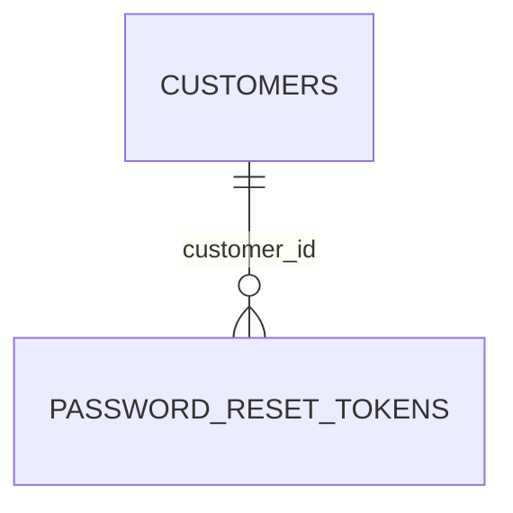

# Auth Database Schema

Schema for the **Auth** pages — the customer-facing `/login`, `/register`,
and `/forgot-password` routes (`LoginForm.js`, `RegisterForm.js`,
`ForgotPasswordForm.js`). Types are written in PostgreSQL dialect; adapt as
needed for another engine.

This is a schema proposal only — nothing in the app currently reads from or
writes to a real database. It's derived directly from the fields already
collected/displayed across those three forms, so every column below traces
back to a specific form field or UI element.

## Entity-relationship diagram

`CUSTOMERS` is defined in
[`orders-database-schema.md`](../orders/orders-database-schema.md) — the
account a Login/Register form authenticates against. This doc adds no new
columns to that table; see Design notes for the two fields it's still
missing (`terms_accepted_at`, `email_verified_at`) and why they aren't added
here.

## Tables

### `password_reset_tokens`

Backs the Forgot Password flow: one row per "Send Reset Link" click.

| Column                  | Type           | Constraints                                              | Notes                                                          |
| ------------------------ | -------------- | ------------------------------------------------------------ | ------------------------------------------------------------------- |
| `id`                     | `UUID`         | PK, default `gen_random_uuid()`                                |                                                                       |
| `customer_id`            | `UUID`         | NOT NULL, FK → `customers.id` ON DELETE CASCADE                | The account requesting a reset                                       |
| `token_hash`             | `VARCHAR(255)` | NOT NULL, UNIQUE                                              | SHA-256 of the raw token emailed to the customer; see Design notes   |
| `requested_email`        | `VARCHAR(255)` | NOT NULL                                                      | Snapshot of the email typed into the form; see Design notes          |
| `expires_at`             | `TIMESTAMPTZ`  | NOT NULL                                                      | Reset links are time-limited (e.g. `created_at` + 1 hour)            |
| `used_at`                | `TIMESTAMPTZ`  | NULL                                                          | Set once the link is used to actually change the password; NULL = still valid/pending |
| `created_at`             | `TIMESTAMPTZ`  | NOT NULL, DEFAULT `now()`                                      |                                                                       |

Indexes: `UNIQUE (token_hash)`, `INDEX (customer_id)`, `INDEX (expires_at)`
(for a cleanup job pruning expired/unused rows).

## Design notes

- `customers` (identity, `email`, `password_hash`, the partial
  `UNIQUE (email) WHERE is_guest = false` index) is owned by
  `orders-database-schema.md`, not redefined here — Login and Register both
  authenticate against that same table, matching how this repo's other
  cross-cutting docs (e.g. vouchers-coupons's `coupon_redemptions.customer_id`)
  reference `customers` without redeclaring it.
- **Register's "I agree to the Terms of Service and Privacy Policy" checkbox
  (`agreeTerms`)** needs a `terms_accepted_at TIMESTAMPTZ NULL` column on
  `customers`. It isn't added here to keep this change scoped to Auth — the
  same reasoning `orders-database-schema.md` used when it flagged
  `gift_cards.customer_id` for reconciliation instead of editing
  `gift-cards-database-schema.md` directly. Treat this note as that same
  kind of flagged follow-up for whoever next touches the `customers` table.
- **`customers_settings.require_email_verification`** (Settings schema)
  implies an eventual `email_verified_at TIMESTAMPTZ NULL` column on
  `customers` too, but Register has no "verify your email" step in the UI
  today — so, consistent with this repo's rule of only modeling what a page
  actually does, it's called out here rather than added.
- **`rememberMe` (Login) is never persisted.** It only extends the
  session/cookie lifetime the auth layer issues after a successful sign-in —
  the same "transient, not a column" treatment `my-account-database-schema.md`
  gives `current_password` / `new_password` / `confirm_password`.
- **`confirmPassword` (Register) is never persisted**, for the same reason —
  it's a client-side match check against `password` before hashing, not a
  stored value.
- **Only `token_hash` is stored, never the raw reset token** emailed to the
  customer — the same posture this repo already takes with `password_hash`
  and with never persisting raw card numbers/CVVs in
  `my-account-database-schema.md`. The raw token is generated at request
  time, emailed once, and only its hash is looked up when the customer
  clicks the link.
- **A `password_reset_tokens` row is one-time-use.** Once `used_at` is set,
  that token must be rejected on any further attempt even if `expires_at`
  hasn't passed yet — enforced at the application layer, not by a
  constraint, since "already used" and "expired" are different failure
  messages the UI would want to show.
- **`requested_email` is a snapshot**, not a re-read of `customers.email` via
  `customer_id`, on the off chance the account's email is changed between
  the reset request and an audit/support lookup — the same snapshotting
  reasoning `order_line_items` uses for `title`/`sku`/`unit_price` in the
  Orders schema.
- **The actual email delivery ("We sent a password reset link to
  `{email}`") is out of scope for this schema.** Inserting the
  `password_reset_tokens` row is the durable side effect; dispatching the
  email itself is a transactional-email-provider/job-queue concern, not a
  table.
- **The "Continue with Google" button on Login and Register is decorative
  only** — no OAuth flow is wired up in the UI, so nothing about it is
  modeled here. If it's implemented later, prefer a separate
  `oauth_identities (provider, provider_user_id, customer_id)` table over
  adding OAuth columns directly to `customers`, so one customer can link
  multiple providers.
- No new enumerations are introduced by this doc.
