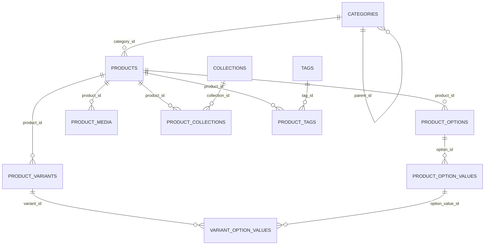

# Catalog Database Schema

Schema for the **Categories / Products** section of the admin panel (Categories,
All Products, Add Product, Add Category pages). Types are written in
PostgreSQL dialect; adapt as needed for another engine.

This is a schema proposal only — nothing in the app currently reads from or
writes to a real database. It's derived directly from the fields already
collected/displayed across those four pages, so every column below traces
back to a specific form field or table column in the UI.

## Entity-relationship diagram

## Tables

### `categories`

Backs the Categories listing page and the Add Category form.

| Column            | Type           | Constraints                                              | Notes                                            |
| ------------------ | -------------- | --------------------------------------------------------- | ------------------------------------------------- |
| `id`               | `UUID`         | PK, default `gen_random_uuid()`                            |                                                     |
| `name`             | `VARCHAR(120)` | NOT NULL                                                   | "Category Title" field                             |
| `slug`             | `VARCHAR(140)` | NOT NULL, UNIQUE                                           | "URL Handle" field, prefixed with `collections/` in the UI |
| `parent_id`        | `UUID`         | NULL, FK → `categories.id` ON DELETE SET NULL              | "Parent Category" select; NULL = top-level category |
| `description`      | `TEXT`         | NULL                                                       |                                                     |
| `image_url`        | `TEXT`         | NULL                                                       | Category image upload                              |
| `theme_template`   | `VARCHAR(20)`  | NOT NULL, DEFAULT `'default'`, CHECK IN (`default`, `featured`, `grid`) | "Theme Template" select                            |
| `is_visible`       | `BOOLEAN`      | NOT NULL, DEFAULT `true`                                   | Shown as "Visible"/"Hidden" badge on the listing   |
| `seo_title`        | `VARCHAR(70)`  | NULL                                                       | "Page Title" (SEO)                                 |
| `seo_description`  | `VARCHAR(160)` | NULL                                                       | "Meta Description" (SEO)                           |
| `created_at`       | `TIMESTAMPTZ`  | NOT NULL, DEFAULT `now()`                                  |                                                     |
| `updated_at`       | `TIMESTAMPTZ`  | NOT NULL, DEFAULT `now()`                                  |                                                     |

Indexes: `UNIQUE (slug)`, `INDEX (parent_id)`.

### `products`

Backs the All Products listing and the Add Product form. Base price,
SKU, and inventory live here for a simple product with no variants; when
options/variants exist, `product_variants` rows override these per
combination (mirrors the app's own JSON payload, which always includes
top-level pricing/inventory/shipping plus an optional `variants[]` array).

| Column               | Type            | Constraints                                                 | Notes                                       |
| --------------------- | --------------- | ------------------------------------------------------------ | --------------------------------------------- |
| `id`                  | `UUID`          | PK, default `gen_random_uuid()`                               |                                                |
| `title`               | `VARCHAR(255)`  | NOT NULL                                                      |                                                |
| `handle`              | `VARCHAR(255)`  | NOT NULL, UNIQUE                                              | Product URL handle, auto-slugified from title |
| `description`         | `TEXT`          | NULL                                                          | Rich-text HTML from the description editor    |
| `category_id`         | `UUID`          | NULL, FK → `categories.id` ON DELETE SET NULL                 | "Product category" field                      |
| `product_type`        | `VARCHAR(100)`  | NULL                                                          |                                                |
| `vendor`              | `VARCHAR(150)`  | NULL                                                          | Shown on the All Products listing             |
| `status`              | `VARCHAR(10)`   | NOT NULL, DEFAULT `'DRAFT'`, CHECK IN (`ACTIVE`, `DRAFT`, `ARCHIVED`) |                                          |
| `price`               | `DECIMAL(12,2)` | NOT NULL, DEFAULT `0`                                         |                                                |
| `compare_at_price`    | `DECIMAL(12,2)` | NULL                                                          |                                                |
| `cost_per_item`       | `DECIMAL(12,2)` | NULL                                                          | Used to compute profit/margin, not shown to customers |
| `charge_tax`          | `BOOLEAN`       | NOT NULL, DEFAULT `true`                                      |                                                |
| `track_quantity`      | `BOOLEAN`       | NOT NULL, DEFAULT `true`                                      |                                                |
| `inventory_quantity`  | `INTEGER`       | NULL                                                          | Base stock count when the product has no variants |
| `sku`                 | `VARCHAR(100)`  | NULL                                                          |                                                |
| `barcode`             | `VARCHAR(100)`  | NULL                                                          | ISBN / UPC / GTIN                             |
| `is_physical_product` | `BOOLEAN`       | NOT NULL, DEFAULT `true`                                      |                                                |
| `weight`              | `DECIMAL(10,3)` | NULL                                                          |                                                |
| `weight_unit`         | `VARCHAR(5)`    | NOT NULL, DEFAULT `'kg'`, CHECK IN (`kg`, `g`, `lb`, `oz`)     |                                                |
| `hs_code`             | `VARCHAR(20)`   | NULL                                                          | Harmonized System code (customs)              |
| `seo_title`           | `VARCHAR(70)`   | NULL                                                          |                                                |
| `seo_description`     | `VARCHAR(160)`  | NULL                                                          |                                                |
| `created_at`          | `TIMESTAMPTZ`   | NOT NULL, DEFAULT `now()`                                     |                                                |
| `updated_at`          | `TIMESTAMPTZ`   | NOT NULL, DEFAULT `now()`                                     |                                                |

Indexes: `UNIQUE (handle)`, `INDEX (category_id)`, `INDEX (status)`,
`INDEX (sku)`.

### `product_options`

One row per variant-generating option (e.g. "Color", "Size").

| Column       | Type           | Constraints                                        | Notes |
| ------------ | -------------- | --------------------------------------------------- | ----- |
| `id`         | `UUID`         | PK                                                   |       |
| `product_id` | `UUID`         | NOT NULL, FK → `products.id` ON DELETE CASCADE       |       |
| `name`       | `VARCHAR(100)` | NOT NULL                                             |       |
| `position`   | `SMALLINT`     | NOT NULL, DEFAULT `0`                                | Display order |

Indexes: `UNIQUE (product_id, name)`.

### `product_option_values`

The chip values entered under each option (e.g. "Black", "Brown").

| Column      | Type           | Constraints                                              | Notes |
| ----------- | -------------- | ----------------------------------------------------------- | ----- |
| `id`        | `UUID`         | PK                                                           |       |
| `option_id` | `UUID`         | NOT NULL, FK → `product_options.id` ON DELETE CASCADE        |       |
| `value`     | `VARCHAR(100)` | NOT NULL                                                     |       |
| `position`  | `SMALLINT`     | NOT NULL, DEFAULT `0`                                        | Display order |

Indexes: `UNIQUE (option_id, value)`.

### `product_variants`

One row per generated option combination (the cartesian product of each
option's values). Only exists for products that have at least one option.

| Column                  | Type            | Constraints                                            | Notes |
| ------------------------ | --------------- | --------------------------------------------------------- | ----- |
| `id`                     | `UUID`          | PK                                                          |       |
| `product_id`             | `UUID`          | NOT NULL, FK → `products.id` ON DELETE CASCADE              |       |
| `sku`                    | `VARCHAR(100)`  | NULL                                                        | Defaults to `{HANDLE}-{n}` when generated |
| `price`                  | `DECIMAL(12,2)` | NULL                                                        | Falls back to `products.price` when unset |
| `compare_at_price`       | `DECIMAL(12,2)` | NULL                                                        |       |
| `inventory_quantity`     | `INTEGER`       | NOT NULL, DEFAULT `0`                                       |       |
| `inventory_management`   | `BOOLEAN`       | NOT NULL, DEFAULT `true`                                    | "Track" checkbox per variant row |
| `weight`                 | `DECIMAL(10,3)` | NULL                                                        |       |
| `weight_unit`            | `VARCHAR(5)`    | NOT NULL, DEFAULT `'kg'`, CHECK IN (`kg`, `g`, `lb`, `oz`)  |       |
| `created_at`             | `TIMESTAMPTZ`   | NOT NULL, DEFAULT `now()`                                   |       |
| `updated_at`             | `TIMESTAMPTZ`   | NOT NULL, DEFAULT `now()`                                   |       |

Indexes: `INDEX (product_id)`, `UNIQUE (sku)` (where `sku IS NOT NULL`).

### `variant_option_values`

Junction recording which option value each variant represents (e.g. a
"Black / Small" variant links to the `Black` and `Small` option values).

| Column             | Type   | Constraints                                                       |
| ------------------- | ------ | -------------------------------------------------------------------- |
| `variant_id`        | `UUID` | NOT NULL, FK → `product_variants.id` ON DELETE CASCADE, PK (part 1) |
| `option_value_id`   | `UUID` | NOT NULL, FK → `product_option_values.id` ON DELETE CASCADE, PK (part 2) |

### `product_media`

Uploaded images, videos, and 3D models attached to a product.

| Column       | Type          | Constraints                                                    | Notes |
| ------------ | ------------- | ------------------------------------------------------------------ | ----- |
| `id`         | `UUID`        | PK                                                                   |       |
| `product_id` | `UUID`        | NOT NULL, FK → `products.id` ON DELETE CASCADE                       |       |
| `type`       | `VARCHAR(10)` | NOT NULL, CHECK IN (`image`, `video`, `model`)                       |       |
| `url`        | `TEXT`        | NOT NULL                                                             |       |
| `name`       | `VARCHAR(255)`| NULL                                                                 | Original filename |
| `position`   | `SMALLINT`    | NOT NULL, DEFAULT `0`                                                | Display order in the media grid |

Indexes: `INDEX (product_id)`.

### `collections`

Curated groupings a product can be added to (separate from the single
taxonomy `category`), e.g. "New Arrivals", "Best Sellers".

| Column | Type           | Constraints          |
| ------ | -------------- | ---------------------- |
| `id`   | `UUID`         | PK                      |
| `name` | `VARCHAR(150)` | NOT NULL, UNIQUE        |
| `slug` | `VARCHAR(160)` | NOT NULL, UNIQUE        |

### `product_collections`

Many-to-many join between products and collections.

| Column          | Type   | Constraints                                                     |
| ---------------- | ------ | -------------------------------------------------------------------- |
| `product_id`      | `UUID` | NOT NULL, FK → `products.id` ON DELETE CASCADE, PK (part 1)          |
| `collection_id`   | `UUID` | NOT NULL, FK → `collections.id` ON DELETE CASCADE, PK (part 2)       |

### `tags`

Free-text labels entered via the tag-chip input.

| Column | Type          | Constraints        |
| ------ | ------------- | --------------------- |
| `id`   | `UUID`        | PK                    |
| `name` | `VARCHAR(60)` | NOT NULL, UNIQUE      |

### `product_tags`

Many-to-many join between products and tags.

| Column       | Type   | Constraints                                                |
| ------------- | ------ | -------------------------------------------------------------- |
| `product_id`  | `UUID` | NOT NULL, FK → `products.id` ON DELETE CASCADE, PK (part 1)     |
| `tag_id`      | `UUID` | NOT NULL, FK → `tags.id` ON DELETE CASCADE, PK (part 2)         |

## Enumerations

| Enum            | Values                            | Used by                          |
| ---------------- | ---------------------------------- | ----------------------------------- |
| Product status    | `ACTIVE`, `DRAFT`, `ARCHIVED`      | `products.status`                   |
| Weight unit        | `kg`, `g`, `lb`, `oz`             | `products.weight_unit`, `product_variants.weight_unit` |
| Media type         | `image`, `video`, `model`         | `product_media.type`                |
| Category theme     | `default`, `featured`, `grid`     | `categories.theme_template`         |

## Design notes

- `category_id` on `products` is a single nullable reference, matching the
  "Product category" autosuggest field (one category per product). Multiple
  loosely-grouped memberships instead go through `product_collections`.
- A category's breadcrumb (e.g. "Jewelry > Rings > Wedding Bands") is
  derived at read time by walking `parent_id`, not stored as a string.
- `products.inventory_quantity` is only meaningful for a product with no
  variants; once `product_variants` rows exist, a product's effective stock
  is the sum of its variants' `inventory_quantity` (as shown in the All
  Products "Inventory" column).
- Money columns use `DECIMAL(12,2)` rather than float types to avoid
  rounding errors in pricing/margin calculations.
