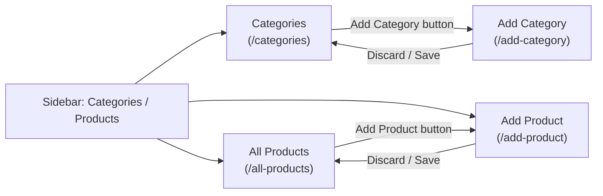
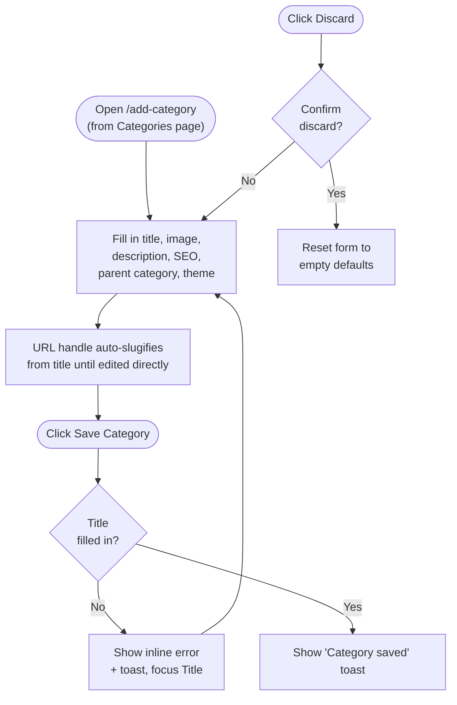
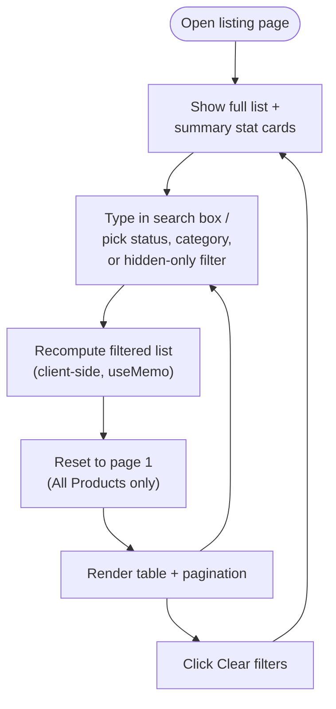
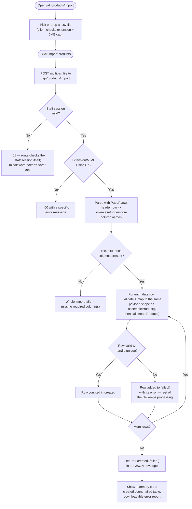

# Categories / Products Workflow

Process flows for the **Categories / Products** section of the admin panel
(sidebar submenu: Categories, All Products, Add Product, Import Products;
Add Category is reached from the Categories page). Pairs with
[`category-product-catalog-database-schema.md`](category-product-catalog-database-schema.md),
which defines the tables these flows would read from and write to once a
real backend exists — today every page here runs on static/in-memory data
only, so "Save" never persists across a page reload.

## 1. Navigation

How the four pages connect, starting from the sidebar.

The sidebar auto-expands the "Categories / Products" submenu and highlights
the current entry based on the active route (see
`src/components/admin-panel/Sidebar.js`) — it isn't hardcoded per page.

## 2. Add Product

Key behavior worth calling out:

- **Variant regeneration preserves edits.** When options change, each new
  option-value combination is matched against the previous variant list by
  a stable key (`Color:Black|Size:Small`); a combination that still exists
  keeps its edited price/SKU/quantity, only genuinely new combinations get
  blank defaults (`regenerateVariants` in `helpers.js`).
- **There is no backend call.** "Save product" only builds the same JSON
  shape defined in the database schema doc's `products` /
  `product_variants` tables and shows it for copy/download — wiring this to
  a real API means POSTing that payload and letting the server split it
  across `products`, `product_options`, `product_variants`, `product_media`,
  and the `product_collections` / `product_tags` join tables.

## 3. Add Category

As with Add Product, saving is a client-side confirmation only — a real
implementation would insert into `categories`, using `parent_id` resolved
from the "Parent Category" select.

## 4. Browse & filter — All Products / Categories

Both listing pages share the same interaction pattern: a client component
owns filter state, derives a filtered (and, for products, paginated) view
from the static dataset, and re-renders the table.

- **All Products** (`ProductsListing.js`) filters by title/SKU text,
  status, and category, then paginates 8 rows at a time.
- **Categories** (`CategoriesListing.js`) filters by name/slug text and a
  "Hidden only" toggle. Each category's product count is computed live
  from the All Products dataset (`computeCategoryCounts`), and a parent
  category's count is the sum of its descendants' — so the two pages
  always agree on totals without any manual syncing.

## 5. Import Products (CSV)

Unlike the rest of this document, this flow is wired to the real database
today — `/all-products/import` (`src/components/import-products/`) posts a
`.csv` file to `POST /api/products/import`, which is backed by
`src/lib/productImport.js` and `createProduct()` in `src/lib/products.js`.

Key behavior worth calling out:

- **Each product reuses `createProduct()` as-is** — the same
  handle-uniqueness check, category-path upsert, and tag/collection upsert
  that Add Product uses.
- **One bad product never aborts the file.** Validation errors (missing
  required field, non-numeric price, invalid status/weight unit) and DB
  errors (duplicate handle) are both caught per product and reported in
  `failed[]`, so a 500-row file with 3 bad products still creates the rest.
- **Required columns**: `title`, `sku`, `price`. Optional columns cover the
  same fields as the Add Product form — see `src/components/import-products/helpers.js`
  for the exact list and `src/lib/productImport.js` for validation rules.
  Multi-value cells (`tags`, `collections`, `image_url`) are
  semicolon-separated; `category` uses the same `"Parent > Child"` path
  syntax as the rest of this section.
- **Variable products (with options/variants) are one row per variant.**
  `groupRowsByProduct()` groups every row that shares a non-empty `handle`
  into a single product; `buildOptionsAndVariants()` then reads each row's
  `option1_name`/`option1_value` (through `option3_name`/`option3_value`)
  plus `variant_sku`, `variant_price`, `variant_compare_at_price`,
  `variant_inventory_quantity`, `variant_weight`/`variant_weight_unit`, and
  `variant_image_url` into that product's `options[]`/`variants[]` — the
  same shape `regenerateVariants()` produces for the Add Product form. Only
  the group's first row needs the product-level columns (title, sku, price,
  description, ...); a row with no `handle` at all is still treated as its
  own simple, single-SKU product, so existing simple-product CSVs keep
  working unchanged. The Import Products page offers a matching "Variable
  product sample" download alongside the simple one.

## 6. Export Products (CSV)

The **Export** button on `/all-products` (`ExportProductsButton.js`) calls
`GET /api/products/export`, backed by `src/lib/productExport.js`. It reads
every product with `listProducts()` + `getProductById()` and writes the same
column set `productImport.js` reads (simple products as one row, variable
products as one row per variant, grouped by `handle`) — so an exported file
can be re-imported unchanged, and it doubles as a full backup of the
catalog.

## Data lifecycle today vs. with a backend

| Step | Today (this app) | With the schema in `category-product-catalog-database-schema.md` |
| ---- | ------------------ | ----------------------------------------------------------------------- |
| Load listing | Read a static array from `src/data/*.js` | `SELECT` from `products` / `categories` with joins for category name, tags, collections |
| Filter/search | In-memory `Array.filter` in the browser | `WHERE` clauses (or a search index) pushed to the server, paginated with `LIMIT`/`OFFSET` |
| Save product/category | Build a JSON object, show it in a modal | `INSERT`/`UPDATE` `products` (+ child tables for options/variants/media/collections/tags) or `categories` in a transaction |
| Discard | Reset local React state | No-op — nothing was written yet |
