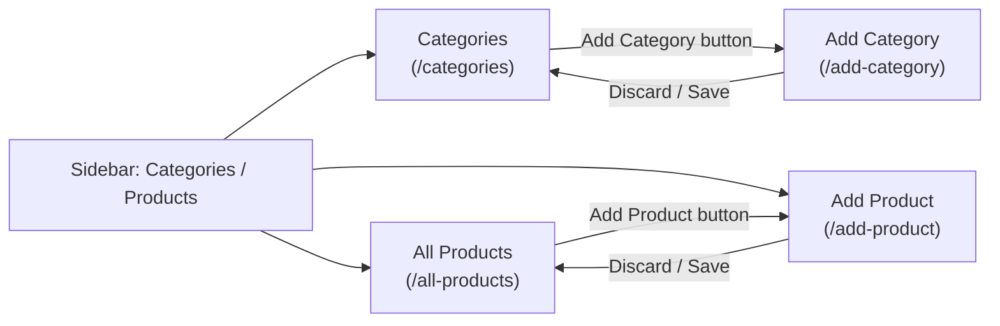
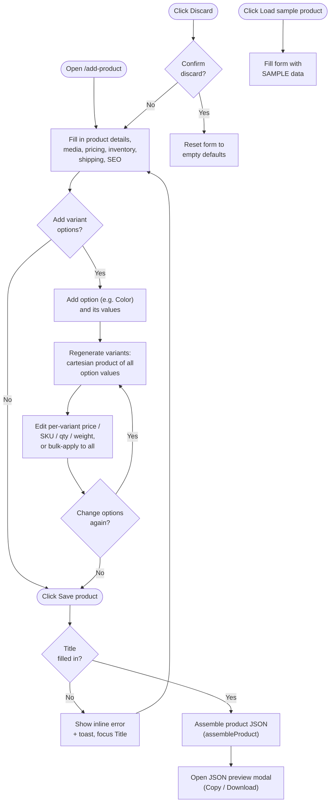

# Categories / Products Workflow

Process flows for the **Categories / Products** section of the admin panel
(sidebar submenu: Categories, All Products, Add Product; Add Category is
reached from the Categories page). Pairs with
[`category-product-catalog-database-schema.md`](category-product-catalog-database-schema.md),
which defines the tables these flows would read from and write to once a
real backend exists — today every page here runs on static/in-memory data
only, so "Save" never persists across a page reload.

## 1. Navigation

How the four pages connect, starting from the sidebar.



The sidebar auto-expands the "Categories / Products" submenu and highlights
the current entry based on the active route (see
`src/components/admin-panel/Sidebar.js`) — it isn't hardcoded per page.

## 2. Add Product



Key behavior worth calling out:

- **Variant regeneration preserves edits.** When options change, each new
  option-value combination is matched against the previous variant list by
  a stable key (`Color:Black|Size:Small`); a combination that still exists
  keeps its edited price/SKU/quantity, only genuinely new combinations get
  blank defaults (`regenerateVariants` in `helpers.js`).
- **There is no backend call.** "Save product" only builds the same JSON
  shape defined in the database schema doc's `products` /
  `product_variants` tables and shows it for copy/download — wiring this to
  a real API means POSTing that payload and letting the server split it
  across `products`, `product_options`, `product_variants`, `product_media`,
  and the `product_collections` / `product_tags` join tables.

## 3. Add Category

```mermaid
flowchart TD
    Start(["Open /add-category\n(from Categories page)"]) --> Fill["Fill in title, image,\ndescription, SEO,\nparent category, theme"]
    Fill --> Handle["URL handle auto-slugifies\nfrom title until edited directly"]
    Handle --> Save(["Click Save Category"])
    Save --> Valid{"Title\nfilled in?"}
    Valid -- "No" --> Err["Show inline error\n+ toast, focus Title"]
    Err --> Fill
    Valid -- "Yes" --> Toast["Show \"Category saved\" toast"]

    Discard(["Click Discard"]) --> Confirm{"Confirm\ndiscard?"}
    Confirm -- "No" --> Fill
    Confirm -- "Yes" --> Reset["Reset form to\nempty defaults"]
```

As with Add Product, saving is a client-side confirmation only — a real
implementation would insert into `categories`, using `parent_id` resolved
from the "Parent Category" select.

## 4. Browse & filter — All Products / Categories

Both listing pages share the same interaction pattern: a client component
owns filter state, derives a filtered (and, for products, paginated) view
from the static dataset, and re-renders the table.


- **All Products** (`ProductsListing.js`) filters by title/SKU text,
  status, and category, then paginates 8 rows at a time.
- **Categories** (`CategoriesListing.js`) filters by name/slug text and a
  "Hidden only" toggle. Each category's product count is computed live
  from the All Products dataset (`computeCategoryCounts`), and a parent
  category's count is the sum of its descendants' — so the two pages
  always agree on totals without any manual syncing.

## Data lifecycle today vs. with a backend

| Step | Today (this app) | With the schema in `category-product-catalog-database-schema.md` |
| ---- | ------------------ | ----------------------------------------------------------------------- |
| Load listing | Read a static array from `src/data/*.js` | `SELECT` from `products` / `categories` with joins for category name, tags, collections |
| Filter/search | In-memory `Array.filter` in the browser | `WHERE` clauses (or a search index) pushed to the server, paginated with `LIMIT`/`OFFSET` |
| Save product/category | Build a JSON object, show it in a modal | `INSERT`/`UPDATE` `products` (+ child tables for options/variants/media/collections/tags) or `categories` in a transaction |
| Discard | Reset local React state | No-op — nothing was written yet |
