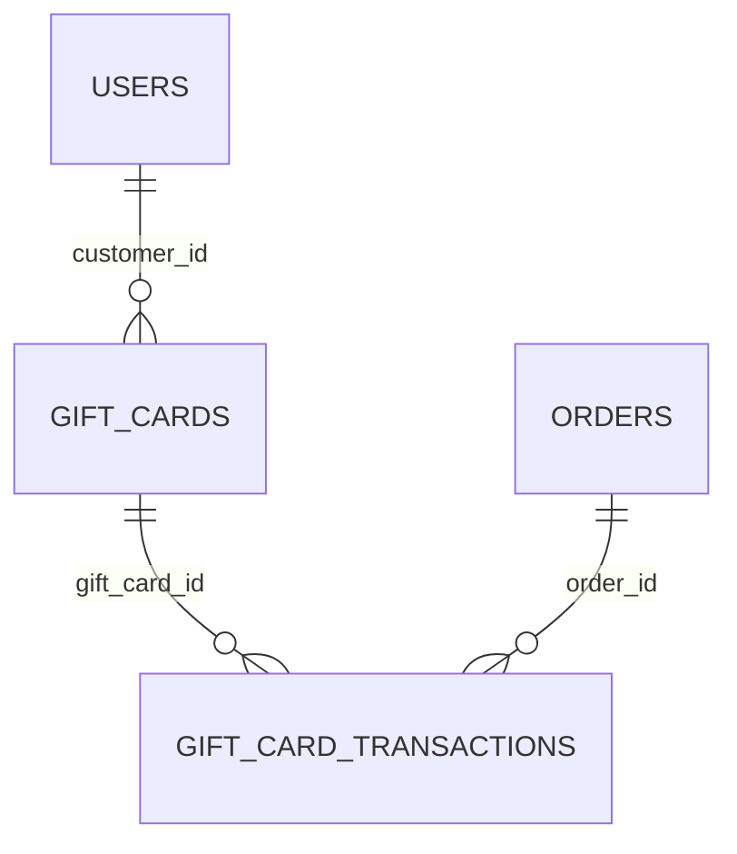

# Gift Cards Database Schema

Schema for the **Gift Cards** section of the app — the customer-facing
`/gift-cards` page (Redeem a Gift Card, Your Gift Cards, Gift Card Activity)
and the admin **Gift Cards** submenu (All Gift Cards / Create Gift Card /
Gift Card Transactions). Types are written in PostgreSQL dialect; adapt as
needed for another engine.

This is a schema proposal only — nothing in the app currently reads from or
writes to a real database. It's derived directly from the fields already
collected/displayed on those pages (`GIFT_CARDS` / `GIFT_CARD_TRANSACTIONS`
in `src/data/accountData.js` and `GiftCardsForm.js`), so every column below
traces back to a specific field or UI element.

## Entity-relationship diagram

`USERS` is defined in
[`my-account-database-schema.md`](../my-account/my-account-database-schema.md)
— the signed-in account a gift card is credited to. `ORDERS` belongs to the
not-yet-documented Orders module — see Design notes.

## Tables

### `gift_cards`

Backs the "Your Gift Cards" list and the account balance shown on the
Gift Cards page.

| Column           | Type            | Constraints                                                      | Notes                                                                 |
| ------------------ | --------------- | --------------------------------------------------------------------- | -------------------------------------------------------------------------- |
| `id`                | `UUID`          | PK, default `gen_random_uuid()`                                         |                                                                              |
| `customer_id`       | `UUID`          | NULL, FK → `users.id` ON DELETE SET NULL                                | The account the card is credited to; see Design notes                       |
| `code`              | `VARCHAR(20)`   | NOT NULL, UNIQUE                                                        | Format `GC-XXXX-XXXX`, auto-formatted client-side by `normalizeGiftCardCode` |
| `initial_value`     | `DECIMAL(12,2)` | NOT NULL                                                                | Face value when the card was issued                                         |
| `balance`           | `DECIMAL(12,2)` | NOT NULL                                                                | Remaining redeemable balance                                                |
| `issued_date`       | `DATE`          | NOT NULL                                                                |                                                                              |
| `expiry_date`       | `DATE`          | NULL                                                                    | NULL = never expires                                                        |
| `status`            | `VARCHAR(10)`   | NOT NULL, DEFAULT `'active'`, CHECK IN (`active`, `redeemed`, `expired`) | `redeemed` = balance fully spent; see Design notes                          |
| `created_at`        | `TIMESTAMPTZ`   | NOT NULL, DEFAULT `now()`                                                |                                                                              |

Indexes: `UNIQUE (code)`, `INDEX (customer_id)`.

### `gift_card_transactions`

Backs the "Gift Card Activity" list. One row per credit (a code added to the
account) or debit (balance spent on an order).

| Column           | Type            | Constraints                                              | Notes                                                            |
| ------------------ | --------------- | -------------------------------------------------------------- | --------------------------------------------------------------------- |
| `id`                | `UUID`          | PK, default `gen_random_uuid()`                                   |                                                                         |
| `gift_card_id`      | `UUID`          | NOT NULL, FK → `gift_cards.id` ON DELETE CASCADE                  |                                                                         |
| `order_id`          | `UUID`          | NULL, FK → `orders.id` ON DELETE SET NULL                         | Set only for a debit made at checkout; Orders module — see Design notes |
| `amount`            | `DECIMAL(12,2)` | NOT NULL                                                          | Positive = credit ("added to account"), negative = debit ("redeemed on an order") |
| `description`       | `VARCHAR(255)`  | NOT NULL                                                          | e.g. `"Redeemed on order #SMB-10479"`, `"Gift card GC-3T7L-4RZ9 added to account"` |
| `created_at`        | `TIMESTAMPTZ`   | NOT NULL, DEFAULT `now()`                                          |                                                                         |

Indexes: `INDEX (gift_card_id)`, `INDEX (order_id)`.

## Enumerations

| Enum              | Values                        | Used by             |
| -------------------- | -------------------------------- | ----------------------- |
| Gift card status      | `active`, `redeemed`, `expired`  | `gift_cards.status`      |

## Design notes

- The UI overloads the word "redeem" for two different actions, both modeled
  here as `gift_card_transactions` rows distinguished by the sign of
  `amount`:
  - **Redeeming a code onto your account** (the "Redeem a Gift Card" form) —
    a credit (`amount > 0`), and the card's `status` stays `active`.
  - **Redeeming balance at checkout** — a debit (`amount < 0`) tied to an
    `order_id`, which drives `balance` down and eventually flips `status` to
    `redeemed` once it hits zero (see the `GC-1A5M-6VD3` sample card: `balance:
    0.00`, `status: "redeemed"`).
- `gift_card_transactions.description` is stored as a denormalized string
  (matching the sample data exactly) rather than composed at read time from
  `gift_card_id`/`order_id`, since the UI already renders a fixed,
  human-written sentence per transaction rather than templating one.
- The client-side sample data (`GIFT_CARD_TRANSACTIONS` in
  `src/data/accountData.js`) links each transaction to a card via its
  `cardCode` string rather than an id. This schema normalizes that into the
  `gift_card_id` foreign key instead, since `code` — while unique — is a
  display/lookup value, not a stable identifier a transaction should be
  keyed on if a card were ever recoded.
- `customer_id` is nullable (`ON DELETE SET NULL`) so a card can exist before
  being tied to an account — e.g. a gift card purchased by one person and
  redeemed by another — even though every card in the current UI already
  belongs to the signed-in account.
- `orders` is referenced by `gift_card_transactions.order_id` but not defined
  in this doc; like `coupon_redemptions.order_id` in the vouchers/coupons
  schema, it belongs to a module not yet formalized in `docs/`. A real
  migration would add that FK once that table exists.
- Money columns use `DECIMAL(12,2)` rather than float types to avoid rounding
  errors, consistent with the other schemas in this repo.
