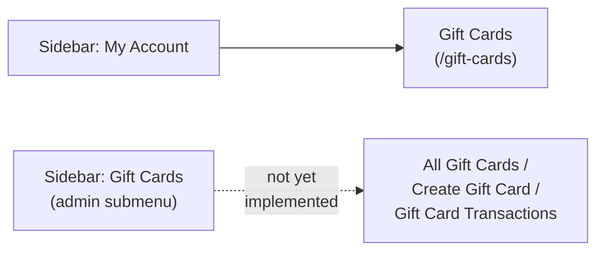
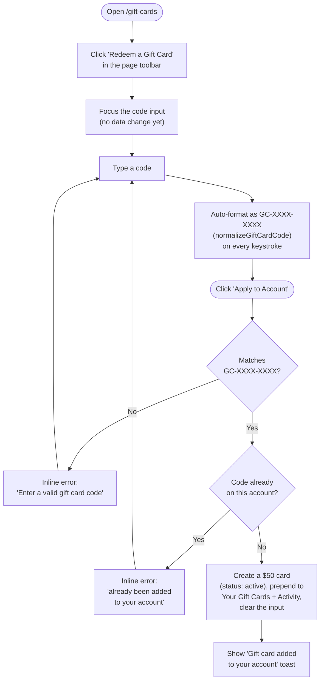
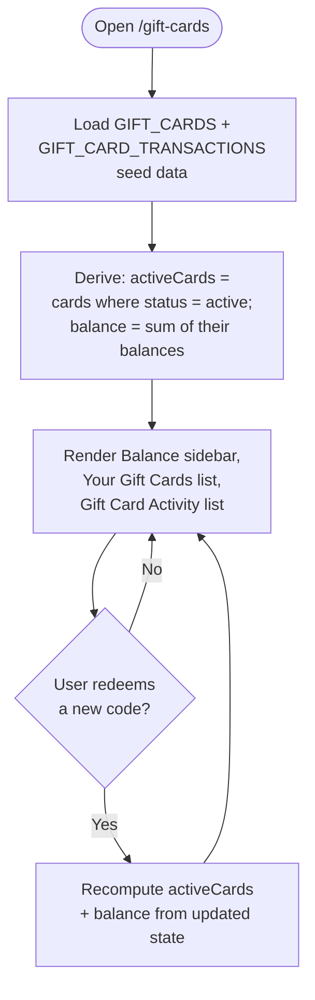
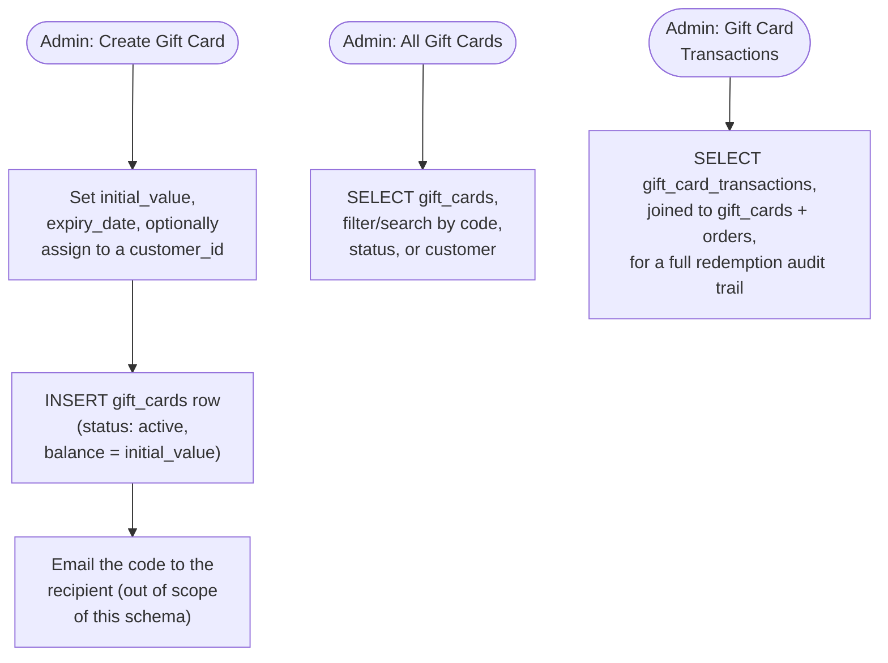
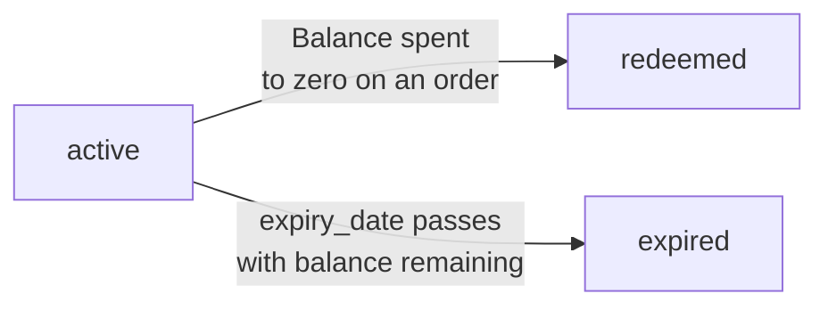

# Gift Cards Workflow

Process flows for the **Gift Cards** section of the app — the customer-facing
`/gift-cards` page (Redeem a Gift Card, Your Gift Cards, Gift Card Activity).
Pairs with
[`gift-cards-database-schema.md`](gift-cards-database-schema.md), which
defines the tables these flows would read from and write to once a real
backend exists — today the page runs on static/in-memory data only
(`GIFT_CARDS` / `GIFT_CARD_TRANSACTIONS` in `src/data/accountData.js`), so
nothing here persists across a page reload.

## 1. Navigation

The sidebar auto-expands the "My Account" submenu and highlights the current
entry based on the active route (see `src/components/admin-panel/Sidebar.js`)
— it isn't hardcoded per page. The **separate** admin "Gift Cards" submenu
(All Gift Cards / Create Gift Card / Gift Card Transactions) exists in the
sidebar config but every link still points to `#` — see § 4.

## 2. Redeem a Gift Card

Key behavior worth calling out:

- **There is no page-level Save/Discard.** Unlike Profile, Address, or the
  Settings pages, redeeming a code commits immediately when "Apply to
  Account" is clicked — the page toolbar's only button ("Redeem a Gift
  Card") just scrolls to and focuses the code input, it doesn't submit
  anything.
- **Every well-formatted, not-yet-added code succeeds.** There's no backend
  to look up a real card's value, so `handleRedeem` always credits a fixed
  **$50** regardless of what the code actually is — a placeholder for the
  real lookup a backend would do against `gift_cards.code`.
- **The new card is prepended, not appended**, to both `cards` and
  `transactions` state, so the just-redeemed card and its credit
  transaction always appear first in their respective lists.

## 3. Browse — Your Gift Cards & Activity

- **Balance is derived, not stored.** `balance` is recomputed on every
  render as the sum of `balance` across cards with `status === "active"` —
  there is no separate "account balance" field anywhere in state.
- **Redeemed cards drop out of the active total automatically.** A card
  whose `status` is `redeemed` (balance spent to zero, e.g. sample card
  `GC-1A5M-6VD3`) is excluded from both `activeCards` and the balance sum,
  without any extra bookkeeping.
- **"Buy a Gift Card" is a placeholder link** (`href="#"` in the Balance
  sidebar) — purchasing a new card to send/redeem isn't implemented, only
  redeeming a code you already have.

## 4. Admin Gift Cards management (not yet implemented in this app)

The pages above only cover a signed-in customer redeeming and viewing their
own cards. The sidebar also advertises an **admin** "Gift Cards" submenu —
All Gift Cards, Create Gift Card, Gift Card Transactions — but every one of
those links is still `href: "#"` in `src/config/admin-panel.config.js`; no
screen exists yet. Documented here, against the tables in
`gift-cards-database-schema.md`, for whoever builds it next:

- **Create Gift Card** is the admin-side counterpart to a customer "Redeem a
  Gift Card" — the row it inserts is exactly what a customer's redeem action
  would otherwise fabricate client-side with a placeholder $50 value.
- **Gift Card Transactions** is the admin view of the same
  `gift_card_transactions` rows the customer-facing Activity list already
  renders, just unscoped to one customer and joined to `orders` for context.

## Gift card status lifecycle

`status` is not stored as a computed column today — the client-side sample
data simply seeds each card with the status that matches its balance
(`GC-1A5M-6VD3` ships with `balance: 0.00, status: "redeemed"`). A production
system would flip `active` → `redeemed` in the same transaction that debits
the last of a card's balance, and would need a scheduled job (or a check at
query time) to flip `active` → `expired` once `expiry_date` passes.

## Data lifecycle today vs. with a backend

| Step | Today (this app) | With the schema in `gift-cards-database-schema.md` |
| ---- | ------------------ | ----------------------------------------------------------------------- |
| Load Gift Cards page | Read `GIFT_CARDS` / `GIFT_CARD_TRANSACTIONS` in-memory seeds | `SELECT` from `gift_cards` WHERE `customer_id`, and `gift_card_transactions` joined on `gift_card_id` |
| Compute balance | Sum active cards' `balance` client-side on every render | `SELECT SUM(balance) FROM gift_cards WHERE customer_id = ? AND status = 'active'`, or a cached rollup |
| Redeem a code | Fabricate a fixed $50 `gift_cards` row + credit `gift_card_transactions` row in local state | Look up the real card by `code`, `UPDATE gift_cards.customer_id`, `INSERT` a credit `gift_card_transactions` row |
| Spend balance at checkout | Not implemented | `UPDATE gift_cards.balance`, `INSERT` a debit `gift_card_transactions` row with `order_id` set, all in one transaction |
| Admin creates a gift card | Not implemented | `INSERT` into `gift_cards` directly (see § 4) |
