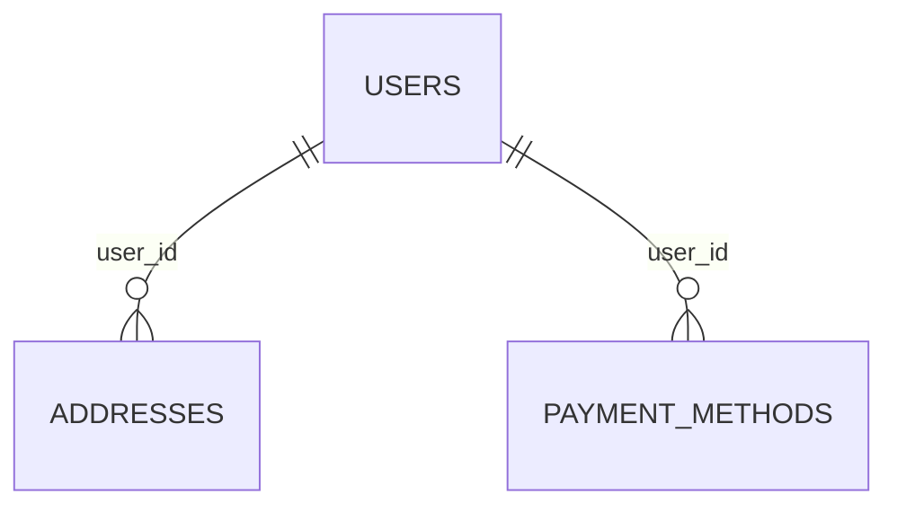

# My Account Database Schema

Schema for the **My Account** section of the admin panel (Profile, Address,
Payment pages). Types are written in PostgreSQL dialect; adapt as needed for
another engine.

This is a schema proposal only — nothing in the app currently reads from or
writes to a real database. It's derived directly from the fields already
collected/displayed across those three pages, so every column below traces
back to a specific form field or UI element.

## Entity-relationship diagram

## Tables

### `users`

Backs the Profile page (Personal Details, Password, Account Status,
Preferences) and the Payment page's billing-address toggle.

| Column                     | Type            | Constraints                                              | Notes                                             |
| --------------------------- | --------------- | ----------------------------------------------------------- | ---------------------------------------------------- |
| `id`                        | `UUID`          | PK, default `gen_random_uuid()`                              |                                                       |
| `avatar_url`                | `TEXT`          | NULL                                                         | Profile photo upload                                 |
| `first_name`                | `VARCHAR(100)`  | NOT NULL                                                     |                                                       |
| `last_name`                 | `VARCHAR(100)`  | NOT NULL                                                     |                                                       |
| `email`                     | `VARCHAR(255)`  | NOT NULL, UNIQUE                                             |                                                       |
| `phone`                     | `VARCHAR(20)`   | NULL                                                         |                                                       |
| `bio`                       | `TEXT`          | NULL                                                         |                                                       |
| `role`                      | `VARCHAR(30)`   | NOT NULL, DEFAULT `'store_admin'`                            | Read-only "Role" badge in Account Status              |
| `language`                  | `VARCHAR(5)`    | NOT NULL, DEFAULT `'en'`                                     | "Language" select                                    |
| `timezone`                  | `VARCHAR(20)`   | NOT NULL, DEFAULT `'UTC+00:00'`                              | "Timezone" select                                    |
| `two_factor_enabled`        | `BOOLEAN`       | NOT NULL, DEFAULT `false`                                    | "Two-Factor Authentication" toggle                   |
| `password_hash`             | `VARCHAR(255)`  | NOT NULL                                                     | Bcrypt/argon2 hash; see Design notes                 |
| `billing_same_as_shipping`  | `BOOLEAN`       | NOT NULL, DEFAULT `true`                                     | "Same as shipping address" toggle on the Payment page |
| `last_login_at`             | `TIMESTAMPTZ`   | NULL                                                         | "Last Login" in Account Status                       |
| `created_at`                | `TIMESTAMPTZ`   | NOT NULL, DEFAULT `now()`                                     | "Member Since" in Account Status                     |
| `updated_at`                | `TIMESTAMPTZ`   | NOT NULL, DEFAULT `now()`                                     |                                                       |

Indexes: `UNIQUE (email)`.

### `addresses`

One row per address type per user — the Address page edits exactly a billing
and a shipping address, not a free-form address book.

| Column                 | Type           | Constraints                                                   | Notes                                            |
| ------------------------ | -------------- | ---------------------------------------------------------------- | --------------------------------------------------- |
| `id`                     | `UUID`         | PK, default `gen_random_uuid()`                                    |                                                       |
| `user_id`                | `UUID`         | NOT NULL, FK → `users.id` ON DELETE CASCADE                        |                                                       |
| `type`                   | `VARCHAR(10)`  | NOT NULL, CHECK IN (`BILLING`, `SHIPPING`)                        |                                                       |
| `full_name`              | `VARCHAR(150)` | NOT NULL                                                           |                                                       |
| `company`                | `VARCHAR(150)` | NULL                                                               | "Company (optional)"                                 |
| `address_line1`          | `VARCHAR(255)` | NOT NULL                                                           |                                                       |
| `address_line2`          | `VARCHAR(255)` | NULL                                                               | "Apartment, suite, unit, etc."                        |
| `city`                   | `VARCHAR(100)` | NOT NULL                                                           |                                                       |
| `state`                  | `VARCHAR(100)` | NULL                                                               | "State / Province"                                    |
| `postal_code`            | `VARCHAR(20)`  | NULL                                                               | "ZIP / Postal Code"                                   |
| `country`                | `VARCHAR(100)` | NOT NULL, DEFAULT `'United States'`                                |                                                       |
| `phone`                  | `VARCHAR(20)`  | NULL                                                               | Formatted `(555) 000-0000`; see Design notes          |
| `same_as_billing`        | `BOOLEAN`      | NOT NULL, DEFAULT `true`                                           | Meaningful only when `type = 'SHIPPING'`              |
| `delivery_instructions`  | `TEXT`         | NULL                                                               | Meaningful only when `type = 'SHIPPING'`              |
| `created_at`             | `TIMESTAMPTZ`  | NOT NULL, DEFAULT `now()`                                           |                                                       |
| `updated_at`             | `TIMESTAMPTZ`  | NOT NULL, DEFAULT `now()`                                           |                                                       |

Indexes: `UNIQUE (user_id, type)`.

### `payment_methods`

Backs the Saved Cards list and Add a Card form on the Payment page.

| Column           | Type           | Constraints                                                  | Notes                                             |
| ------------------ | -------------- | ----------------------------------------------------------------- | ---------------------------------------------------- |
| `id`                | `UUID`         | PK, default `gen_random_uuid()`                                     |                                                       |
| `user_id`           | `UUID`         | NOT NULL, FK → `users.id` ON DELETE CASCADE                         |                                                       |
| `brand`             | `VARCHAR(30)`  | NOT NULL                                                             | Derived from card number prefix (Visa/Mastercard/…)  |
| `last4`             | `CHAR(4)`      | NOT NULL                                                             |                                                       |
| `exp_month`         | `CHAR(2)`      | NOT NULL                                                             |                                                       |
| `exp_year`          | `CHAR(2)`      | NOT NULL                                                             |                                                       |
| `holder_name`       | `VARCHAR(150)` | NOT NULL                                                             |                                                       |
| `is_default`        | `BOOLEAN`      | NOT NULL, DEFAULT `false`                                            | Only one row per `user_id` should be `true`          |
| `provider_token`    | `VARCHAR(255)` | NULL                                                                 | Payment-gateway vault token; see Design notes         |
| `created_at`        | `TIMESTAMPTZ`  | NOT NULL, DEFAULT `now()`                                             |                                                       |

Indexes: `INDEX (user_id)`.

## Enumerations

| Enum          | Values                | Used by         |
| -------------- | ---------------------- | ------------------ |
| Address type    | `BILLING`, `SHIPPING` | `addresses.type`   |

## Design notes

- Card number and CVV are never persisted anywhere — the Add a Card form
  only derives `brand` and `last4` client-side (`detectBrand`,
  `formatCardNumber`). A real integration would exchange the raw card data
  for a `provider_token` via a payment gateway (Stripe, Braintree, etc.) and
  store only that token plus the display fields shown here.
- `current_password` / `new_password` / `confirm_password` on the Profile
  form are transient — used to verify the existing password and rehash the
  new one — and are never written to columns; only `password_hash` persists.
- `addresses` enforces one billing row and one shipping row per user
  (`UNIQUE (user_id, type)`), matching the Address page's shape today.
  Supporting multiple saved addresses per type later means dropping that
  constraint and adding an `is_default` column, mirroring how
  `payment_methods` already handles multiple cards.
- The phone field on `addresses` is stored in the `(555) 000-0000` US format
  the UI formats it to, even though `country` is a free country picker — a
  known simplification of today's form, not a general E.164 phone field.
- `billing_same_as_shipping` lives on `users` rather than on the address
  rows because it reflects a Payment-page preference (which billing address
  a new card should use), independent of the `addresses.same_as_billing`
  flag that governs the Address page's own shipping section.
