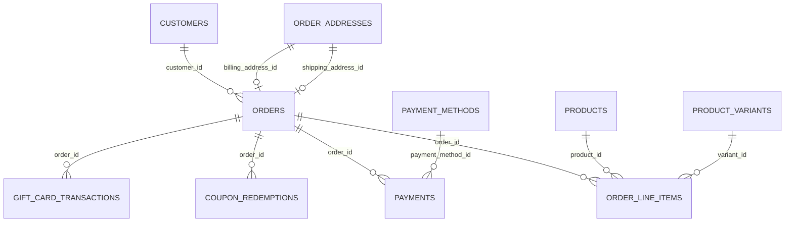

# Orders Database Schema

Schema for the **Orders** section of the admin panel (All Orders, Pending,
Processing, Completed, Cancelled pages). Types are written in PostgreSQL
dialect; adapt as needed for another engine.

This is a schema proposal only — nothing in the app currently reads from or
writes to a real database. `orders` and its status/payment columns are
derived directly from `src/data/ordersData.js` and `OrdersTable.js`, which is
a flat list with no customer, address, or line-item records behind it. This
doc adds the minimal supporting tables (`customers`, `order_addresses`,
`order_line_items`, `payments`) a real checkout needs to produce that same
listing — each is justified in Design notes below, the same way
`coupon_redemptions` was added alongside `coupons` in the vouchers/coupons
schema.

## Entity-relationship diagram

`PRODUCTS` / `PRODUCT_VARIANTS` are defined in
[`category-product-catalog-database-schema.md`](../category-product/category-product-catalog-database-schema.md).
`PAYMENT_METHODS` is defined in
[`my-account-database-schema.md`](../my-account/my-account-database-schema.md)
— a saved card a customer chose at checkout. `COUPON_REDEMPTIONS` and
`GIFT_CARD_TRANSACTIONS` are defined in
[`vouchers-coupons-database-schema.md`](../vouchers-coupons/vouchers-coupons-database-schema.md)
and
[`gift-cards-database-schema.md`](../gift-cards/gift-cards-database-schema.md)
respectively; both already declared an `order_id` FK expecting this table to
exist — see Design notes. Store-wide order/customer configuration
(`orders_settings`, `customers_settings`) already lives in
[`settings-database-schema.md`](../settings/settings-database-schema.md) and
is not repeated here.

## Tables

### `customers`

The person an order is placed by — distinct from `users` in the My Account
schema, which models the store's own admin/staff login. See Design notes.

| Column               | Type           | Constraints                                                   | Notes                                                           |
| --------------------- | -------------- | -------------------------------------------------------------- | ------------------------------------------------------------------ |
| `id`                  | `UUID`         | PK, default `gen_random_uuid()`                                  |                                                                      |
| `first_name`          | `VARCHAR(100)` | NOT NULL                                                         |                                                                      |
| `last_name`           | `VARCHAR(100)` | NOT NULL                                                         |                                                                      |
| `email`               | `VARCHAR(255)` | NOT NULL                                                         | See Design notes on the partial unique index                        |
| `phone`               | `VARCHAR(20)`  | NULL                                                             |                                                                      |
| `password_hash`       | `VARCHAR(255)` | NULL                                                             | NULL for a guest-checkout row; see Design notes                     |
| `customer_group`      | `VARCHAR(20)`  | NOT NULL, DEFAULT `'Retail'`, CHECK IN (`Retail`, `Wholesale`, `VIP`) | Mirrors `customers_settings.default_customer_group`                 |
| `loyalty_points`      | `INTEGER`      | NOT NULL, DEFAULT `0`                                            | Only meaningful when `customers_settings.enable_loyalty_points` is true |
| `accepts_marketing`   | `BOOLEAN`      | NOT NULL, DEFAULT `false`                                        | Seeded from `customers_settings.default_marketing_consent` at signup |
| `is_guest`            | `BOOLEAN`      | NOT NULL, DEFAULT `false`                                        | true for a one-off row created because `customers_settings.allow_guest_checkout` is on |
| `created_at`          | `TIMESTAMPTZ`  | NOT NULL, DEFAULT `now()`                                        |                                                                      |
| `updated_at`          | `TIMESTAMPTZ`  | NOT NULL, DEFAULT `now()`                                        |                                                                      |

Indexes: `UNIQUE (email) WHERE is_guest = false` (guest rows may reuse an
email address a registered account already holds), `INDEX (email)`.

### `order_addresses`

A frozen billing or shipping address, captured at checkout. Never edited
after creation — unlike `addresses` in the My Account schema, which a user
edits in place.

| Column           | Type           | Constraints                          | Notes |
| ------------------ | -------------- | --------------------------------------- | ----- |
| `id`                | `UUID`         | PK, default `gen_random_uuid()`           |       |
| `type`              | `VARCHAR(10)`  | NOT NULL, CHECK IN (`BILLING`, `SHIPPING`) | Same enum shape as `addresses.type` in the My Account schema |
| `full_name`         | `VARCHAR(150)` | NOT NULL                                  |       |
| `company`           | `VARCHAR(150)` | NULL                                       |       |
| `address_line1`     | `VARCHAR(255)` | NOT NULL                                  |       |
| `address_line2`     | `VARCHAR(255)` | NULL                                       |       |
| `city`              | `VARCHAR(100)` | NOT NULL                                  |       |
| `state`             | `VARCHAR(100)` | NULL                                       |       |
| `postal_code`       | `VARCHAR(20)`  | NULL                                       |       |
| `country`           | `VARCHAR(100)` | NOT NULL                                  |       |
| `phone`             | `VARCHAR(20)`  | NULL                                       |       |
| `created_at`        | `TIMESTAMPTZ`  | NOT NULL, DEFAULT `now()`                  |       |

### `orders`

Backs the All Orders / Pending / Processing / Completed / Cancelled listings.

| Column               | Type            | Constraints                                                         | Notes                                                                  |
| ---------------------- | --------------- | ---------------------------------------------------------------------- | --------------------------------------------------------------------------- |
| `id`                    | `UUID`          | PK, default `gen_random_uuid()`                                          |                                                                               |
| `order_number`          | `VARCHAR(30)`   | NOT NULL, UNIQUE                                                        | e.g. `SMB-10504`; the listing's `#` prefix is display-only — see Design notes |
| `customer_id`           | `UUID`          | NULL, FK → `customers.id` ON DELETE SET NULL                            | Nullable so history survives account deletion; see Design notes             |
| `customer_name`         | `VARCHAR(150)`  | NOT NULL                                                                | Snapshot shown in the "Customer" column; see Design notes                   |
| `billing_address_id`    | `UUID`          | NULL, FK → `order_addresses.id` ON DELETE SET NULL                      |                                                                               |
| `shipping_address_id`   | `UUID`          | NULL, FK → `order_addresses.id` ON DELETE SET NULL                      |                                                                               |
| `status`                | `VARCHAR(10)`   | NOT NULL, DEFAULT `'Pending'`, CHECK IN (`Pending`, `Processing`, `Completed`, `Cancelled`) | Default mirrors `orders_settings.default_order_status`                      |
| `payment_status`        | `VARCHAR(10)`   | NOT NULL, DEFAULT `'Unpaid'`, CHECK IN (`Paid`, `Unpaid`, `Refunded`)   | Denormalized summary of `payments`; see Design notes                        |
| `total_amount`          | `DECIMAL(12,2)` | NOT NULL                                                                | Matches the listing's "Amount" column; see Design notes on the breakdown    |
| `currency`              | `VARCHAR(3)`    | NOT NULL, DEFAULT `'INR'`                                               | See Design notes on the default                                            |
| `placed_at`             | `TIMESTAMPTZ`   | NOT NULL, DEFAULT `now()`                                               | Matches the listing's "Date" column                                         |
| `cancelled_at`          | `TIMESTAMPTZ`   | NULL                                                                    | Set when `status` transitions to `Cancelled`                               |
| `created_at`            | `TIMESTAMPTZ`   | NOT NULL, DEFAULT `now()`                                               |                                                                               |
| `updated_at`            | `TIMESTAMPTZ`   | NOT NULL, DEFAULT `now()`                                               |                                                                               |

Indexes: `UNIQUE (order_number)`, `INDEX (customer_id)`, `INDEX (status)`,
`INDEX (payment_status)`.

### `order_line_items`

One row per product/quantity purchased on an order. Not shown by any current
page (there's no order-detail view yet), but required for the "Products"
column and for `total_amount` to mean anything — see Design notes.

| Column        | Type            | Constraints                                                | Notes                                    |
| -------------- | --------------- | --------------------------------------------------------------- | --------------------------------------------- |
| `id`           | `UUID`          | PK, default `gen_random_uuid()`                                   |                                                |
| `order_id`     | `UUID`          | NOT NULL, FK → `orders.id` ON DELETE CASCADE                      |                                                |
| `product_id`   | `UUID`          | NULL, FK → `products.id` ON DELETE SET NULL                       |                                                |
| `variant_id`   | `UUID`          | NULL, FK → `product_variants.id` ON DELETE SET NULL               |                                                |
| `title`        | `VARCHAR(255)`  | NOT NULL                                                          | Snapshot of `products.title` at purchase time |
| `sku`          | `VARCHAR(100)`  | NULL                                                              | Snapshot                                      |
| `unit_price`   | `DECIMAL(12,2)` | NOT NULL                                                          | Snapshot                                      |
| `quantity`     | `INTEGER`       | NOT NULL, DEFAULT `1`                                             |                                                |
| `line_total`   | `DECIMAL(12,2)` | NOT NULL                                                          | `unit_price * quantity` at purchase time      |

Indexes: `INDEX (order_id)`, `INDEX (product_id)`.

### `payments`

One row per payment attempt/capture against an order.

| Column               | Type            | Constraints                                                        | Notes                                                         |
| ---------------------- | --------------- | ----------------------------------------------------------------------- | ------------------------------------------------------------------- |
| `id`                   | `UUID`          | PK, default `gen_random_uuid()`                                           |                                                                       |
| `order_id`             | `UUID`          | NOT NULL, FK → `orders.id` ON DELETE CASCADE                              |                                                                       |
| `payment_method_id`    | `UUID`          | NULL, FK → `payment_methods.id` ON DELETE SET NULL                        | The saved card used, if any — My Account schema                     |
| `provider`             | `VARCHAR(10)`   | NOT NULL, CHECK IN (`stripe`, `paypal`, `razorpay`, `cod`)               | Mirrors the four gateways toggled on `payment_settings`              |
| `status`               | `VARCHAR(10)`   | NOT NULL, DEFAULT `'pending'`, CHECK IN (`pending`, `succeeded`, `failed`, `refunded`) |                                                    |
| `amount`               | `DECIMAL(12,2)` | NOT NULL                                                                  |                                                                       |
| `provider_reference`   | `VARCHAR(255)`  | NULL                                                                      | Gateway charge/transaction id                                        |
| `created_at`           | `TIMESTAMPTZ`   | NOT NULL, DEFAULT `now()`                                                 |                                                                       |

Indexes: `INDEX (order_id)`.

## Enumerations

| Enum                  | Values                                          | Used by                                    |
| ------------------------ | -------------------------------------------------- | ----------------------------------------------- |
| Order status              | `Pending`, `Processing`, `Completed`, `Cancelled`   | `orders.status`                                  |
| Order payment status       | `Paid`, `Unpaid`, `Refunded`                       | `orders.payment_status`                          |
| Order address type         | `BILLING`, `SHIPPING`                              | `order_addresses.type`                           |
| Customer group              | `Retail`, `Wholesale`, `VIP`                       | `customers.customer_group` (see also `customers_settings.default_customer_group`) |
| Payment provider            | `stripe`, `paypal`, `razorpay`, `cod`              | `payments.provider`                              |
| Payment transaction status  | `pending`, `succeeded`, `failed`, `refunded`        | `payments.status`                                |

## Design notes

- `customers` is introduced here as an entity distinct from `users` in the My
  Account schema. `users` models the store's own logged-in admin (`role`
  defaults to `'store_admin'`); it has no concept of the person buying a
  product. `gift_cards.customer_id` in the gift-cards schema currently points
  at `users.id`, written on the assumption that a storefront account reuses
  the admin's own table — this doc diverges from that and treats them as
  separate tables instead, matching how `coupon_redemptions.customer_id` in
  the vouchers/coupons schema already anticipated a standalone `customers`
  table. Reconciling `gift_cards.customer_id` to point at `customers.id`
  instead is a reasonable follow-up, flagged here rather than changed in that
  file to keep this change scoped to Orders.
- `orders.customer_id` is nullable with `ON DELETE SET NULL`, and
  `customer_name` is stored alongside it as a snapshot, so an order stays
  fully readable in the listing even after the customer's account is deleted
  (`customers_settings.allow_self_delete_account`) — the same reasoning as
  `order_line_items.title` / `sku` / `unit_price` snapshotting catalog data
  that may later change or be deleted.
- `order_number` stores just the prefix + number (e.g. `SMB-10504`); the
  leading `#` shown in `ordersData.js`/`OrdersTable.js` is a display
  convention, not a stored character. The `SMB-` prefix is configurable via
  `orders_settings.order_number_prefix` in the settings schema.
- `orders.total_amount` is a single figure because the current listing only
  ever shows one "Amount" column — there's no subtotal/discount/shipping/tax
  breakdown in the UI today. A real store would decompose this into those
  parts (and likely a `coupon_redemptions` link for the discount applied),
  deferred here until a checkout/order-detail page actually needs it.
- The listing's "Products" column (`"2 items"`) is derived at read time —
  `COUNT(*)` or `SUM(quantity)` over `order_line_items` for that
  `order_id` — rather than stored as a column, the same way category product
  counts are computed from `products` rather than cached on `categories`.
- `avatarColor`, `initials`, `paymentColor`, and `statusColor` in
  `src/data/ordersData.js` are pure UI-rendering concerns (a badge color
  looked up from `status`/`payment_status`, and avatar initials derived from
  `customer_name`) and are intentionally not modeled as columns — the same
  exclusion the catalog schema made for `categories.imageColor`.
- `orders.payment_status` is a denormalized summary of that order's
  `payments` rows (e.g. `'Paid'` once a `succeeded` payment covers
  `total_amount`, `'Refunded'` once a matching refund posts), the same
  denormalization pattern as `coupons.usage_count` — kept in sync by
  application logic rather than computed via a join on every listing render.
- `orders.currency` defaults to `'INR'` to match the ₹-formatted amounts
  already in `ordersData.js`, even though `general_settings.currency` and
  `currency_tax_settings.currency` both default to `'USD'` in the settings
  schema — an existing inconsistency in that doc, not one introduced here.
- Money columns use `DECIMAL(12,2)` rather than float types to avoid rounding
  errors, consistent with the other schemas in this repo.
