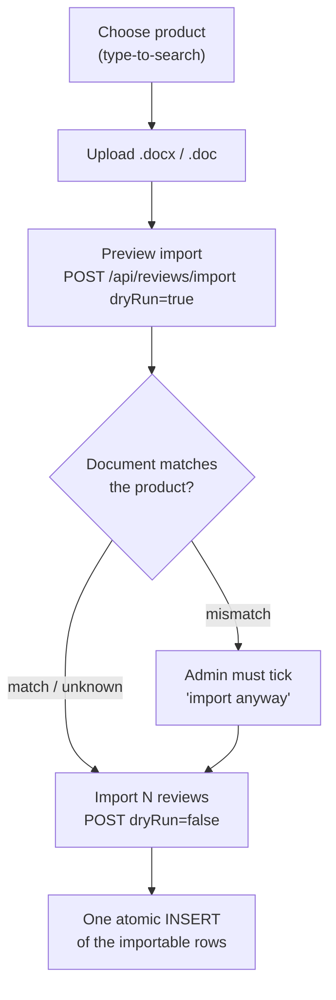

# Import Reviews

Admin page **Product Reviews → Import Reviews** (`/admin/import-reviews`). An
admin picks one product, uploads a Word document (`.docx` or legacy `.doc`) of
reviews, checks a preview, and confirms. Every review in the file is added to
that product only. No schema change: rows go into `product_reviews`
(see [`reviews-database-schema.md`](reviews-database-schema.md)).

Permission: **Import Reviews** (`reviews.import`). Setting a status other than
Pending also needs **Approve Reviews** (`reviews.approve`); without it every
imported review is saved as Pending, whatever the client sends.

## Flow



The preview writes nothing. The import repeats every check on the server and
inserts all importable reviews in a **single** `INSERT`, so it is all or
nothing. Changing the product or the file, or pressing Cancel, discards the
preview.

## Document layout

```
Product Details
Product Name   Twisted Women's Wedding Band with Diamonds   <- optional table
SKU            MBR-RS5100                                      (label <tab> value)
Review Count   4

Customer Reviews
★★★★★  5/5            <- a rating line starts every review
Onica P.              <- reviewer's display name
The rose gold band is unique. Love it.   <- review text (one or more lines)
```

- **Rating line:** stars (`★`, `½` for a half) and/or a score such as `5/5`,
  `4.5/5` or `4.5 out of 5`. Whole and half stars from 0.5 to 5 only; the
  denominator must be 5. If stars and score disagree, the score wins (warning).
  A line such as `5/5 would buy again` is review text, not a rating line.
- **Name:** the line after the rating line, or on it after a separator
  (`★★★★★ 5/5 – Onica P.`), or a `Name:` line. With no name the review is
  imported as "Anonymous" (warning).
- **Optional lines** inside a review: `Title: …` and `Email: …`.
- **Title:** when absent it is made from the first sentence of the review
  (trimmed to 80 characters) and marked "made from the review text".
- **Email:** when absent a placeholder is stored, `imported-review@example.invalid`
  (a reserved `.invalid` address that can never receive mail). Emails are
  admin-only and never shown on the storefront; edit the review to replace it.
- **Product details table:** used only to check the selection. The SKU and/or
  product name are compared with the chosen product (ignoring case,
  punctuation and curly vs straight apostrophes). A mismatch is shown in red
  and the admin must confirm; the server refuses a mismatched import
  (`409`) unless `confirmMismatch=true`. `Review Count` that differs from the
  number of reviews found raises a warning.

Both formats are read into the same text lines (table rows become
tab-separated lines), so one parser handles `.docx` and `.doc`.

## Rules and limits

| Rule | Value |
| ---- | ----- |
| File types | `.docx`, `.doc` — the extension is checked **and** the file's first bytes (zip / OLE signature), so a renamed PDF or image is rejected |
| File size | 4 MB (`413`) — kept under Vercel's ~4.5 MB request-body cap |
| `word/document.xml` unpacked size | 20 MB cap, so a small "zip bomb" is never inflated |
| Reviews per file | 500 |
| Field limits | title 150, review text 5,000, display name 100, email 254 |
| Duplicates | same reviewer name + same text, per product, ignoring case and spacing — skipped (also within one file) |
| Rows with errors | skipped and reported; the rest are imported |

The upload is read in memory and never written to disk; macros, embedded
objects and images in the document are ignored.

## API

`POST /api/reviews/import` — `multipart/form-data`, permission `reviews.import`.

| Field | Notes |
| ----- | ----- |
| `file` | the Word document |
| `productId` | the only product the reviews are added to |
| `status` | `PENDING` / `APPROVED` / `REJECTED`; honoured only with `reviews.approve` |
| `dryRun` | anything except `false` is a preview that writes nothing |
| `confirmMismatch` | `true` to import a document that names a different product |

Responses use the usual `{ success, data }` / `{ success: false, error }`
envelope. Statuses: `400` invalid input or unreadable file, `404` unknown
product, `409` product mismatch not confirmed, `413` too large, `415` not a Word
file, `500` unexpected (logged server-side; the message is generic).

`data` (both modes): `fileName`, `status` applied, `product`, `document`
(name, SKU, overall rating, review count from the file), `productCheck`
(`match` / `mismatch` / `unknown` + message), `warnings`, `reviews` (each with
`rating`, `title`, `titleDerived`, `content`, `displayName`, `email`,
`issues`, `duplicate`, `importable`), `counts`, `dryRun` and `imported`.

A successful import is logged in the admin notifications ("N reviews imported
for …").

## Code map

| Path | Role |
| ---- | ---- |
| `src/lib/reviewImportParser.js` | pure: lines → document details + reviews + issues |
| `src/lib/reviewImportFile.js` | validation, `.docx` (fflate, size-capped) and `.doc` (word-extractor) → lines |
| `src/lib/reviewImport.js` | product lookup/match, duplicate detection, atomic insert |
| `src/app/api/reviews/import/route.js` | upload handler |
| `src/app/admin/import-reviews/` | page and loading skeleton |
| `src/components/import-reviews/` | form, preview, helpers |
