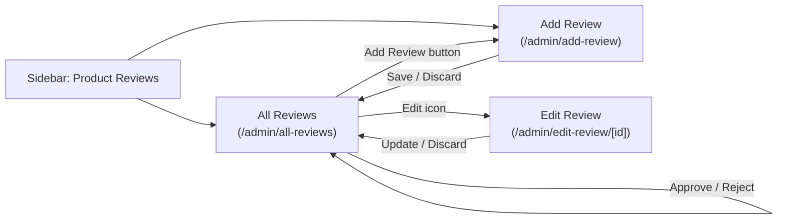

# Product Reviews

Schema and workflow for the **Product Reviews** section of the admin panel
(sidebar submenu: All Reviews, Add Review). Types are written in PostgreSQL
dialect. The SQL lives in [`reviews-table-only.sql`](reviews-table-only.sql);
apply it with `npm run db:migrate:reviews` (needs the `products` table from
`npm run db:migrate` first).

Ratings started out as whole stars (`SMALLINT`, 1–5). A table created that
way is upgraded to half stars by
[`reviews-half-star-ratings-only.sql`](reviews-half-star-ratings-only.sql)
(`npm run db:migrate:reviews-half-stars`); it keeps existing ratings and is
safe to re-run. A fresh `db:migrate:reviews` already creates the new column.

## Review form fields

| Form field     | Column         | Type           | Rules                                            |
| -------------- | -------------- | -------------- | ------------------------------------------------ |
| Rating         | `rating`       | `NUMERIC(2,1)` | Required, 0.5–5 in half-star steps (`CHECK`); shown as whole and half stars |
| Review title   | `title`        | `VARCHAR(150)` | Required                                          |
| Review content | `content`      | `TEXT`         | Required, up to 5,000 characters (app-enforced)   |
| Display name   | `display_name` | `VARCHAR(100)` | Required; the public name shown with the review   |
| Email address  | `email`        | `VARCHAR(254)` | Required, valid address, stored lowercase; admin-only |

Two admin-only columns complete the row:

| Column       | Type          | Notes                                                                     |
| ------------ | ------------- | ------------------------------------------------------------------------- |
| `product_id` | `UUID`        | NOT NULL, FK → `products.id` ON DELETE CASCADE (reviews go with the product) |
| `status`     | `VARCHAR(10)` | `PENDING` (default), `APPROVED` or `REJECTED` — the moderation state       |

Plus `id` (`UUID`, PK), `created_at` and `updated_at` (`TIMESTAMPTZ`).
Indexes: `product_id`, `status`, `created_at DESC`.

## Moderation

- `PENDING` — waiting for a moderator. `APPROVED` — the only state the
  storefront should ever display. `REJECTED` — kept for the record, never shown.
- Changing a review's status needs the **Approve Reviews** permission
  (`reviews.approve`). Without it, new reviews are always saved as `PENDING`
  and an edit leaves the existing status untouched, whatever the client sends.
- The email address is contact data for staff. Do not render it on the storefront.

## Pages and API

| Page                        | Permission        | Purpose                                            |
| --------------------------- | ----------------- | -------------------------------------------------- |
| `/admin/all-reviews`        | `reviews.view`    | Stats, search/filter, approve/reject, edit, delete |
| `/admin/add-review`         | `reviews.create`  | Add a review by hand                               |
| `/admin/edit-review/[id]`   | `reviews.edit`    | Edit a review                                      |

The **Product** field on the form is a type-to-search box: it asks
`/api/reviews/products?q=` for up to 8 matching products (title or SKU
contains the text, titles starting with it first, thumbnail included) and
only stores the chosen product's id. Typing after picking a product clears
the selection, so the saved product always matches what is shown.

| Route                       | Method | Permission        |
| --------------------------- | ------ | ----------------- |
| `/api/reviews`              | GET    | `reviews.view`    |
| `/api/reviews/products`     | GET    | `reviews.create` or `reviews.edit` (product suggestions, `?q=`) |
| `/api/reviews`              | POST   | `reviews.create`  |
| `/api/reviews/[id]`         | GET    | `reviews.view` or `reviews.edit` |
| `/api/reviews/[id]`         | PUT    | `reviews.edit`    |
| `/api/reviews/[id]`         | PATCH  | `reviews.approve` (status only) |
| `/api/reviews/[id]`         | DELETE | `reviews.delete`  |

All responses use the `{ success, data }` / `{ success: false, error }`
envelope. Invalid input returns `400`, a missing review `404`.

## Storefront

The **Customer Reviews** tab of the product page (`/products/[handle]`) shows
the reviews and lets shoppers write one. No table changes were needed.

**Display** — `getPublicReviewsForProduct` (`src/lib/reviews.js`) reads only
`APPROVED` rows, newest first (up to 50), plus the count and average over all
approved reviews. It never selects the email. The tab shows the average with
half-star-aware stars, "Based on N reviews", and five reviews at a time with a
"Show more reviews" button. The rating line next to the product title links to
the tab (`#reviews`, which also works as a shared deep link).

**Write a review** — an inline form (rating in half-star steps, name, email,
title, review). It posts to a public endpoint:

| Route                    | Method | Auth   | Purpose                                   |
| ------------------------ | ------ | ------ | ----------------------------------------- |
| `/api/storefront/reviews` | POST   | public | Submit a review for moderation (`201`)    |

`submitStorefrontReview` handles the request and always saves the row through
`createReview` **without** `canApprove`, so it is `PENDING` whatever the client
sends; a moderator approves it in All Reviews and only then does it appear. The
product comes from the `handle` (must be an `ACTIVE` product), never from an id
in the request. Protections, in order:

- A hidden **honeypot** field: a filled one gets a normal-looking `201` and
  nothing is saved.
- **Settings → Products → "Allow customer reviews"** (`allowReviews`, default
  on). When off, the form is hidden and the endpoint returns `403`; reviews
  already approved keep displaying. A missing settings row counts as on.
- The same validation the form uses (`src/components/storefront/reviews/helpers.js`,
  limits from `src/lib/reviewFields.js`), then `createReview` validates again.
  Invalid input returns `400`; a body over 40 KB returns `413`.
- **Rate limits** (in-memory, see `src/lib/rateLimit.js`): 5 per client IP per
  10 minutes and 3 per email address per hour, answered with `429`. Invalid
  submissions don't count against them.
- **One review per email per product** (a `REJECTED` one doesn't count, so the
  shopper can try again): `409`.
- Unknown or non-active product handle: `404`.

The email is stored lowercase and is contact data for staff only; it is never
sent back to the storefront.
