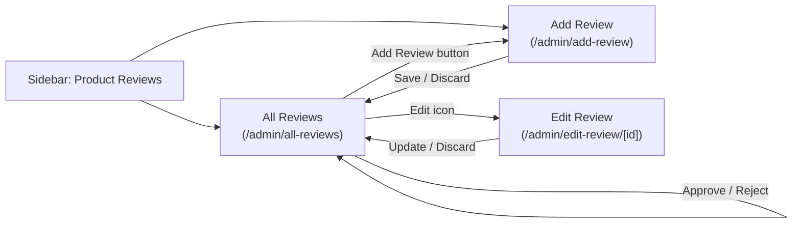

# Product Reviews

Schema and workflow for the **Product Reviews** section of the admin panel
(sidebar submenu: All Reviews, Add Review). Types are written in PostgreSQL
dialect. The SQL lives in [`reviews-table-only.sql`](reviews-table-only.sql);
apply it with `npm run db:migrate:reviews` (needs the `products` table from
`npm run db:migrate` first).

## Review form fields

| Form field     | Column         | Type           | Rules                                            |
| -------------- | -------------- | -------------- | ------------------------------------------------ |
| Rating         | `rating`       | `SMALLINT`     | Required, whole number 1–5 (`CHECK`)              |
| Review title   | `title`        | `VARCHAR(150)` | Required                                          |
| Review content | `content`      | `TEXT`         | Required, up to 5,000 characters (app-enforced)   |
| Display name   | `display_name` | `VARCHAR(100)` | Required; the public name shown with the review   |
| Email address  | `email`        | `VARCHAR(254)` | Required, valid address, stored lowercase; admin-only |

Two admin-only columns complete the row:

| Column       | Type          | Notes                                                                     |
| ------------ | ------------- | ------------------------------------------------------------------------- |
| `product_id` | `UUID`        | NOT NULL, FK → `products.id` ON DELETE CASCADE (reviews go with the product) |
| `status`     | `VARCHAR(10)` | `PENDING` (default), `APPROVED` or `REJECTED` — the moderation state       |

Plus `id` (`UUID`, PK), `created_at` and `updated_at` (`TIMESTAMPTZ`).
Indexes: `product_id`, `status`, `created_at DESC`.

## Moderation

- `PENDING` — waiting for a moderator. `APPROVED` — the only state the
  storefront should ever display. `REJECTED` — kept for the record, never shown.
- Changing a review's status needs the **Approve Reviews** permission
  (`reviews.approve`). Without it, new reviews are always saved as `PENDING`
  and an edit leaves the existing status untouched, whatever the client sends.
- The email address is contact data for staff. Do not render it on the storefront.

## Pages and API

| Page                        | Permission        | Purpose                                            |
| --------------------------- | ----------------- | -------------------------------------------------- |
| `/admin/all-reviews`        | `reviews.view`    | Stats, search/filter, approve/reject, edit, delete |
| `/admin/add-review`         | `reviews.create`  | Add a review by hand                               |
| `/admin/edit-review/[id]`   | `reviews.edit`    | Edit a review                                      |

The **Product** field on the form is a type-to-search box: it asks
`/api/reviews/products?q=` for up to 8 matching products (title or SKU
contains the text, titles starting with it first, thumbnail included) and
only stores the chosen product's id. Typing after picking a product clears
the selection, so the saved product always matches what is shown.

| Route                       | Method | Permission        |
| --------------------------- | ------ | ----------------- |
| `/api/reviews`              | GET    | `reviews.view`    |
| `/api/reviews/products`     | GET    | `reviews.create` or `reviews.edit` (product suggestions, `?q=`) |
| `/api/reviews`              | POST   | `reviews.create`  |
| `/api/reviews/[id]`         | GET    | `reviews.view` or `reviews.edit` |
| `/api/reviews/[id]`         | PUT    | `reviews.edit`    |
| `/api/reviews/[id]`         | PATCH  | `reviews.approve` (status only) |
| `/api/reviews/[id]`         | DELETE | `reviews.delete`  |

All responses use the `{ success, data }` / `{ success: false, error }`
envelope. Invalid input returns `400`, a missing review `404`.

## Not built yet

There is no public "write a review" form on the storefront and no review
display on product pages. A future storefront endpoint should insert rows with
`status = 'PENDING'` through `src/lib/reviews.js` (`createReview`, called
without `canApprove`) and read only `APPROVED` rows.
