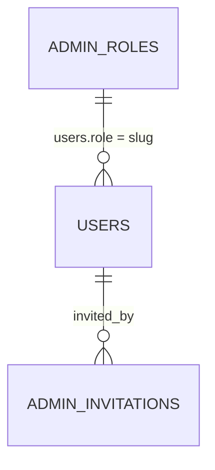

# Settings Database Schema

Schema for the **Settings** section of the admin panel — the 20 pages under
`/settings/*` (General, Store, Currency & Tax, Payment, Shipping, Orders,
Customers, Products, Inventory, Checkout, Returns & Refunds, Discounts &
Coupons, Email, Notifications, SEO, Security, Admin & Roles, Integrations,
Social Media, Legal, System & Maintenance). Types are written in PostgreSQL
dialect; adapt as needed for another engine.

This is a schema proposal only — nothing in the app currently reads from or
writes to a real database. Every settings page is a client component that
initializes its fields from a local `DEFAULT_SETTINGS` object and only shows a
toast on Save/Discard, so every column below traces back to a specific field
in one of those `DEFAULT_SETTINGS` objects (or, for Admin & Roles, to its
invite form). Discounts & Coupons is already documented as `coupon_settings`
in
[`vouchers-coupons-database-schema.md`](../vouchers-coupons/vouchers-coupons-database-schema.md)
and is not repeated here.

## Entity-relationship diagram

`USERS` is defined in
[`my-account-database-schema.md`](../my-account/my-account-database-schema.md)
— an admin account accepting an invitation becomes a row in that table. Every
other table on this page is an independent singleton with no foreign keys, so
it is omitted from the diagram; see Design notes.

## Tables

Eighteen of the pages below follow the same **singleton** shape as
`coupon_settings`: exactly one row (`id SMALLINT PK CHECK (id = 1)`) holding
that whole page's fields, since each page always edits one fixed set of
store-wide values rather than a list of records. Admin & Roles is the one
exception — it also needs `admin_invitations` for the pending-invite list.

### `general_settings`

Backs the Settings → General page.

| Column             | Type           | Constraints                      | Notes                                                    |
| ------------------- | -------------- | ------------------------------------ | ------------------------------------------------------------- |
| `id`                | `SMALLINT`     | PK, CHECK (`id = 1`)                  | Enforces a single row                                          |
| `store_name`        | `VARCHAR(150)` | NOT NULL, DEFAULT `'Shop My Band'`    |                                                                 |
| `logo_url`          | `TEXT`         | NULL                                  | "Logo" uploader; NULL when no file chosen                      |
| `favicon_url`       | `TEXT`         | NULL                                  | "Favicon" uploader                                             |
| `store_email`       | `VARCHAR(255)` | NOT NULL, DEFAULT `'hello@shopmyband.com'` | Validated client-side with `isValidEmail`                |
| `phone`             | `VARCHAR(20)`  | NULL                                  |                                                                 |
| `address`           | `VARCHAR(255)` | NULL                                  |                                                                 |
| `country`           | `VARCHAR(100)` | NOT NULL, DEFAULT `'United States'`   |                                                                 |
| `state`             | `VARCHAR(100)` | NULL                                  |                                                                 |
| `city`              | `VARCHAR(100)` | NULL                                  |                                                                 |
| `timezone`          | `VARCHAR(20)`  | NOT NULL, DEFAULT `'UTC+05:30'`       |                                                                 |
| `date_time_format`  | `VARCHAR(20)`  | NOT NULL, DEFAULT `'MM/DD/YYYY 12h'`  |                                                                 |
| `language`          | `VARCHAR(5)`   | NOT NULL, DEFAULT `'en'`              |                                                                 |
| `currency`          | `VARCHAR(3)`   | NOT NULL, DEFAULT `'USD'`             | One of `CURRENCIES` (`src/data/accountData.js`); see Design notes |
| `updated_at`        | `TIMESTAMPTZ`  | NOT NULL, DEFAULT `now()`             |                                                                 |

### `store_settings`

Backs the Settings → Store page.

| Column                 | Type           | Constraints                                                                  | Notes |
| ------------------------ | -------------- | --------------------------------------------------------------------------------- | ----- |
| `id`                     | `SMALLINT`     | PK, CHECK (`id = 1`)                                                                |       |
| `legal_business_name`    | `VARCHAR(200)` | NULL                                                                                |       |
| `business_type`          | `VARCHAR(20)`  | NOT NULL, DEFAULT `'LLC'`, CHECK IN (`Sole Proprietorship`, `LLC`, `Corporation`, `Partnership`, `Other`) |       |
| `store_url`              | `VARCHAR(255)` | NULL                                                                                |       |
| `tax_id`                 | `VARCHAR(50)`  | NULL                                                                                |       |
| `support_email`          | `VARCHAR(255)` | NULL                                                                                |       |
| `support_phone`          | `VARCHAR(20)`  | NULL                                                                                |       |
| `support_hours`          | `VARCHAR(100)` | NULL                                                                                |       |
| `store_is_live`          | `BOOLEAN`      | NOT NULL, DEFAULT `true`                                                            | Storefront on/off switch |
| `updated_at`             | `TIMESTAMPTZ`  | NOT NULL, DEFAULT `now()`                                                           |       |

### `currency_tax_settings`

Backs the Settings → Currency & Tax page.

| Column                       | Type            | Constraints                                                    | Notes |
| ------------------------------ | --------------- | ------------------------------------------------------------------- | ----- |
| `id`                            | `SMALLINT`      | PK, CHECK (`id = 1`)                                                  |       |
| `currency`                     | `VARCHAR(3)`    | NOT NULL, DEFAULT `'USD'`                                             | Independent of `general_settings.currency`; see Design notes |
| `currency_position`            | `VARCHAR(6)`    | NOT NULL, DEFAULT `'before'`, CHECK IN (`before`, `after`)            | `$100.00` vs `100.00$`               |
| `number_format`                | `VARCHAR(10)`   | NOT NULL, DEFAULT `'1,234.56'`, CHECK IN (`1,234.56`, `1.234,56`, `1 234.56`) |                        |
| `prices_include_tax`           | `BOOLEAN`       | NOT NULL, DEFAULT `false`                                             |                                       |
| `default_tax_rate`             | `DECIMAL(5,2)`  | NOT NULL, DEFAULT `8.25`                                              |                                       |
| `tax_registration_number`      | `VARCHAR(50)`   | NULL                                                                  |                                       |
| `apply_tax_to_shipping`        | `BOOLEAN`       | NOT NULL, DEFAULT `true`                                              |                                       |
| `enable_tax_exempt_groups`     | `BOOLEAN`       | NOT NULL, DEFAULT `false`                                             |                                       |
| `updated_at`                   | `TIMESTAMPTZ`   | NOT NULL, DEFAULT `now()`                                             |                                       |

### `payment_settings`

Backs the Settings → Payment page.

| Column              | Type            | Constraints                | Notes |
| --------------------- | --------------- | ------------------------------- | ----- |
| `id`                  | `SMALLINT`      | PK, CHECK (`id = 1`)             |       |
| `stripe_enabled`      | `BOOLEAN`       | NOT NULL, DEFAULT `true`         |       |
| `paypal_enabled`      | `BOOLEAN`       | NOT NULL, DEFAULT `false`        |       |
| `razorpay_enabled`    | `BOOLEAN`       | NOT NULL, DEFAULT `false`        |       |
| `cod_enabled`         | `BOOLEAN`       | NOT NULL, DEFAULT `true`         | Cash on delivery                     |
| `public_key`          | `VARCHAR(255)`  | NULL                             | Gateway publishable key               |
| `secret_key`          | `VARCHAR(255)`  | NULL                             | Gateway secret key; see Design notes  |
| `transaction_fee`     | `DECIMAL(5,2)`  | NOT NULL, DEFAULT `2.9`          | Percent per transaction               |
| `cod_min_order`       | `DECIMAL(12,2)` | NOT NULL, DEFAULT `0`            | Minimum order amount to allow COD     |
| `auto_capture`        | `BOOLEAN`       | NOT NULL, DEFAULT `true`         | Capture payment immediately vs. authorize-only |
| `updated_at`          | `TIMESTAMPTZ`   | NOT NULL, DEFAULT `now()`        |                                       |

### `shipping_settings`

Backs the Settings → Shipping page.

| Column                    | Type            | Constraints                                                             | Notes |
| --------------------------- | --------------- | ----------------------------------------------------------------------------- | ----- |
| `id`                         | `SMALLINT`      | PK, CHECK (`id = 1`)                                                            |       |
| `default_carrier`           | `VARCHAR(20)`   | NOT NULL, DEFAULT `'USPS'`, CHECK IN (`USPS`, `UPS`, `FedEx`, `DHL`, `Local Courier`) |       |
| `flat_rate_fee`             | `DECIMAL(12,2)` | NOT NULL, DEFAULT `5.99`                                                        |       |
| `free_shipping_threshold`   | `DECIMAL(12,2)` | NOT NULL, DEFAULT `75`                                                          | Order subtotal at/above which shipping is free |
| `processing_time_days`      | `SMALLINT`      | NOT NULL, DEFAULT `2`                                                           |       |
| `weight_unit`               | `VARCHAR(2)`    | NOT NULL, DEFAULT `'lb'`, CHECK IN (`lb`, `kg`, `g`, `oz`)                      | Defaults to, and is kept in sync with, `products_settings.default_weight_unit` whenever Settings → Products is saved |
| `dimension_unit`            | `VARCHAR(2)`    | NOT NULL, DEFAULT `'in'`, CHECK IN (`in`, `cm`)                                 |       |
| `local_pickup_enabled`      | `BOOLEAN`       | NOT NULL, DEFAULT `false`                                                       |       |
| `updated_at`                | `TIMESTAMPTZ`   | NOT NULL, DEFAULT `now()`                                                       |       |

### `orders_settings`

Backs the Settings → Orders page.

| Column                        | Type          | Constraints                                                        | Notes |
| ------------------------------- | ------------- | ------------------------------------------------------------------------ | ----- |
| `id`                             | `SMALLINT`    | PK, CHECK (`id = 1`)                                                       |       |
| `order_number_prefix`           | `VARCHAR(20)` | NOT NULL, DEFAULT `'SMB-'`                                                 |       |
| `starting_order_number`         | `INTEGER`     | NOT NULL, DEFAULT `10000`                                                  | Seed value for the next generated order number |
| `auto_cancel_hours`             | `SMALLINT`    | NOT NULL, DEFAULT `24`, CHECK (`auto_cancel_hours >= 24`)                  | Auto-cancel unpaid orders after this many hours; minimum 24 |
| `default_order_status`          | `VARCHAR(20)` | NOT NULL, DEFAULT `'Pending'`, CHECK IN (`Pending`, `Processing`, `Completed`) |    |
| `require_confirmation_email`    | `BOOLEAN`     | NOT NULL, DEFAULT `true`                                                   |       |
| `allow_order_edits`             | `BOOLEAN`     | NOT NULL, DEFAULT `false`                                                  | Whether admins can edit an order after it's placed |
| `updated_at`                    | `TIMESTAMPTZ` | NOT NULL, DEFAULT `now()`                                                  |       |

### `customers_settings`

Backs the Settings → Customers page.

| Column                        | Type          | Constraints                                                     | Notes |
| ------------------------------- | ------------- | ---------------------------------------------------------------------- | ----- |
| `id`                             | `SMALLINT`    | PK, CHECK (`id = 1`)                                                     |       |
| `allow_guest_checkout`          | `BOOLEAN`     | NOT NULL, DEFAULT `true`                                                 |       |
| `require_email_verification`   | `BOOLEAN`     | NOT NULL, DEFAULT `true`                                                 |       |
| `allow_self_delete_account`     | `BOOLEAN`     | NOT NULL, DEFAULT `false`                                                |       |
| `default_customer_group`       | `VARCHAR(20)` | NOT NULL, DEFAULT `'Retail'`, CHECK IN (`Retail`, `Wholesale`, `VIP`)   |       |
| `enable_loyalty_points`         | `BOOLEAN`     | NOT NULL, DEFAULT `false`                                                |       |
| `default_marketing_consent`     | `BOOLEAN`     | NOT NULL, DEFAULT `false`                                                | Pre-checked state of the marketing opt-in at signup |
| `updated_at`                    | `TIMESTAMPTZ` | NOT NULL, DEFAULT `now()`                                                |       |

### `products_settings`

Backs the Settings → Products page.

| Column                  | Type          | Constraints                                              | Notes |
| ------------------------- | ------------- | --------------------------------------------------------------- | ----- |
| `id`                       | `SMALLINT`    | PK, CHECK (`id = 1`)                                              |       |
| `sku_prefix`               | `VARCHAR(20)` | NULL                                                              |       |
| `default_status`           | `VARCHAR(10)` | NOT NULL, DEFAULT `'draft'`, CHECK IN (`draft`, `published`)      | Status a new product is created with |
| `default_weight_unit`      | `VARCHAR(2)`  | NOT NULL, DEFAULT `'lb'`, CHECK IN (`lb`, `kg`, `g`, `oz`)        | Pushed to `shipping_settings.weight_unit` whenever this is saved |
| `allow_backorders`         | `BOOLEAN`     | NOT NULL, DEFAULT `false`                                         |       |
| `allow_reviews`            | `BOOLEAN`     | NOT NULL, DEFAULT `true`                                          |       |
| `show_low_stock_badge`     | `BOOLEAN`     | NOT NULL, DEFAULT `true`                                          |       |
| `low_stock_threshold`      | `INTEGER`     | NOT NULL, DEFAULT `5`                                             | Units remaining that trigger the badge |
| `updated_at`               | `TIMESTAMPTZ` | NOT NULL, DEFAULT `now()`                                         |       |

### `inventory_settings`

Backs the Settings → Inventory page.

| Column                    | Type          | Constraints                                                                          | Notes |
| --------------------------- | ------------- | ------------------------------------------------------------------------------------------ | ----- |
| `id`                         | `SMALLINT`    | PK, CHECK (`id = 1`)                                                                         |       |
| `track_inventory`           | `BOOLEAN`     | NOT NULL, DEFAULT `true`                                                                     |       |
| `low_stock_threshold`       | `INTEGER`     | NOT NULL, DEFAULT `5`                                                                        | Duplicated on `products_settings`; see Design notes |
| `out_of_stock_behavior`     | `VARCHAR(20)` | NOT NULL, DEFAULT `'Hide product'`, CHECK IN (`Hide product`, `Show as sold out`, `Allow backorder`) | |
| `multiple_warehouses`       | `BOOLEAN`     | NOT NULL, DEFAULT `false`                                                                    |       |
| `email_on_low_stock`        | `BOOLEAN`     | NOT NULL, DEFAULT `true`                                                                     |       |
| `restock_alert_email`       | `VARCHAR(255)`| NULL                                                                                         |       |
| `updated_at`                | `TIMESTAMPTZ` | NOT NULL, DEFAULT `now()`                                                                    |       |

### `checkout_settings`

Backs the Settings → Checkout page.

| Column                       | Type            | Constraints                | Notes |
| ------------------------------ | --------------- | ------------------------------- | ----- |
| `id`                            | `SMALLINT`      | PK, CHECK (`id = 1`)             |       |
| `allow_guest_checkout`         | `BOOLEAN`       | NOT NULL, DEFAULT `true`         | Duplicated on `customers_settings`; see Design notes |
| `require_phone`                | `BOOLEAN`       | NOT NULL, DEFAULT `false`        |       |
| `require_terms`                | `BOOLEAN`       | NOT NULL, DEFAULT `true`         |       |
| `minimum_order_amount`         | `DECIMAL(12,2)` | NOT NULL, DEFAULT `0`            |       |
| `send_abandoned_cart_emails`   | `BOOLEAN`       | NOT NULL, DEFAULT `true`         |       |
| `reminder_delay_hours`         | `SMALLINT`      | NOT NULL, DEFAULT `4`            | Delay before the first abandoned-cart email |
| `updated_at`                   | `TIMESTAMPTZ`   | NOT NULL, DEFAULT `now()`        |       |

### `returns_refunds_settings`

Backs the Settings → Returns & Refunds page.

| Column                     | Type           | Constraints                                                                     | Notes |
| ---------------------------- | -------------- | -------------------------------------------------------------------------------------- | ----- |
| `id`                          | `SMALLINT`     | PK, CHECK (`id = 1`)                                                                     |       |
| `return_window_days`         | `SMALLINT`     | NOT NULL, DEFAULT `30`                                                                   |       |
| `restocking_fee_percent`     | `DECIMAL(5,2)` | NOT NULL, DEFAULT `0`                                                                     |       |
| `allow_exchanges`            | `BOOLEAN`      | NOT NULL, DEFAULT `true`                                                                  |       |
| `refund_method`              | `VARCHAR(30)`  | NOT NULL, DEFAULT `'Original payment method'`, CHECK IN (`Original payment method`, `Store credit`, `Either`) | |
| `return_shipping_paid_by`    | `VARCHAR(10)`  | NOT NULL, DEFAULT `'Customer'`, CHECK IN (`Customer`, `Store`)                            |       |
| `auto_approve_returns`       | `BOOLEAN`      | NOT NULL, DEFAULT `false`                                                                 |       |
| `updated_at`                 | `TIMESTAMPTZ`  | NOT NULL, DEFAULT `now()`                                                                 |       |

### `email_settings`

Backs the Settings → Email page.

| Column                             | Type           | Constraints                | Notes |
| ------------------------------------- | -------------- | ------------------------------- | ----- |
| `id`                                   | `SMALLINT`     | PK, CHECK (`id = 1`)             |       |
| `smtp_host`                            | `VARCHAR(255)` | NULL                             |       |
| `smtp_port`                            | `INTEGER`      | NULL                             |       |
| `smtp_username`                        | `VARCHAR(255)` | NULL                             |       |
| `smtp_password`                        | `VARCHAR(255)` | NULL                             | Should be stored encrypted, not plaintext; see Design notes |
| `sender_name`                          | `VARCHAR(150)` | NULL                             |       |
| `sender_email`                         | `VARCHAR(255)` | NULL                             |       |
| `send_order_confirmation_emails`       | `BOOLEAN`      | NOT NULL, DEFAULT `true`         |       |
| `send_shipping_notification_emails`    | `BOOLEAN`      | NOT NULL, DEFAULT `true`         |       |
| `send_marketing_emails`                | `BOOLEAN`      | NOT NULL, DEFAULT `false`        |       |
| `email_footer_text`                    | `TEXT`         | NULL                             |       |
| `updated_at`                           | `TIMESTAMPTZ`  | NOT NULL, DEFAULT `now()`        |       |

### `notifications_settings`

Backs the Settings → Notifications page.

| Column                        | Type           | Constraints                | Notes |
| -------------------------------- | -------------- | ------------------------------- | ----- |
| `id`                              | `SMALLINT`     | PK, CHECK (`id = 1`)             |       |
| `new_order_email_alert`          | `BOOLEAN`      | NOT NULL, DEFAULT `true`         |       |
| `low_stock_alert`                | `BOOLEAN`      | NOT NULL, DEFAULT `true`         |       |
| `new_customer_signup_alert`      | `BOOLEAN`      | NOT NULL, DEFAULT `false`        |       |
| `notification_recipient_email`   | `VARCHAR(255)` | NOT NULL, DEFAULT `'admin@shopmyband.com'` | Where the alerts above are sent |
| `enable_sms_notifications`       | `BOOLEAN`      | NOT NULL, DEFAULT `false`        |       |
| `enable_push_notifications`      | `BOOLEAN`      | NOT NULL, DEFAULT `false`        |       |
| `toast_timeout_seconds`          | `SMALLINT`     | NOT NULL, DEFAULT `3`, CHECK BETWEEN 1 AND 30 | How long admin toasts stay visible before auto-dismissing |
| `updated_at`                     | `TIMESTAMPTZ`  | NOT NULL, DEFAULT `now()`        |       |

### `seo_settings`

Backs the Settings → SEO page.

| Column                    | Type          | Constraints                | Notes |
| ---------------------------- | ------------- | ------------------------------- | ----- |
| `id`                          | `SMALLINT`    | PK, CHECK (`id = 1`)             |       |
| `default_meta_title`         | `VARCHAR(70)` | NULL                             |       |
| `default_meta_description`   | `VARCHAR(320)`| NULL                             |       |
| `google_analytics_id`        | `VARCHAR(30)` | NULL                             |       |
| `facebook_pixel_id`          | `VARCHAR(30)` | NULL                             |       |
| `generate_xml_sitemap`       | `BOOLEAN`     | NOT NULL, DEFAULT `true`         |       |
| `robots_txt_content`         | `TEXT`        | NULL                             |       |
| `updated_at`                 | `TIMESTAMPTZ` | NOT NULL, DEFAULT `now()`        |       |

### `security_settings`

Backs the Settings → Security page.

| Column                     | Type          | Constraints                | Notes |
| ----------------------------- | ------------- | ------------------------------- | ----- |
| `id`                           | `SMALLINT`    | PK, CHECK (`id = 1`)             |       |
| `require_two_factor_auth`     | `BOOLEAN`     | NOT NULL, DEFAULT `false`        | Store-wide 2FA requirement; distinct from the per-user `users.two_factor_enabled` toggle on the My Account Profile page |
| `session_timeout_minutes`     | `SMALLINT`    | NOT NULL, DEFAULT `30`, CHECK (`>= 1`) | Required in the UI |
| `password_expiry_days`        | `SMALLINT`    | NOT NULL, DEFAULT `90`, CHECK (`>= 1`) | Required in the UI |
| `max_login_attempts`          | `SMALLINT`    | NOT NULL, DEFAULT `5`, CHECK (`>= 1`)  | Required in the UI |
| `ip_allowlist`                | `TEXT`        | NULL                             | Optional. Newline-separated IPs/CIDRs; see Design notes |
| `enable_recaptcha`            | `BOOLEAN`     | NOT NULL, DEFAULT `true`         |       |
| `updated_at`                  | `TIMESTAMPTZ` | NOT NULL, DEFAULT `now()`        |       |

### `admin_invitations`

Backs the "Invite Admin" form on the Settings → Admin & Roles page. Unlike
the other Admin & Roles fields, an invite is an action that creates a new
row, not a value edited in place.

| Column         | Type          | Constraints                                                        | Notes |
| ---------------- | ------------- | ------------------------------------------------------------------------ | ----- |
| `id`              | `UUID`        | PK, default `gen_random_uuid()`                                            |       |
| `email`           | `VARCHAR(255)`| NOT NULL                                                                   | "Email Address" field                |
| `role`            | `VARCHAR(20)` | NOT NULL, DEFAULT `'Staff'`, CHECK IN (`Owner`, `Manager`, `Staff`, `Support`) | "Role" select                     |
| `invited_by`      | `UUID`        | NULL, FK → `users.id` ON DELETE SET NULL                                   | The admin who sent the invite         |
| `status`          | `VARCHAR(10)` | NOT NULL, DEFAULT `'PENDING'`, CHECK IN (`PENDING`, `ACCEPTED`, `EXPIRED`, `REVOKED`) | |
| `invited_at`      | `TIMESTAMPTZ` | NOT NULL, DEFAULT `now()`                                                  |       |
| `expires_at`      | `TIMESTAMPTZ` | NOT NULL                                                                   | Typically `invited_at` + 7 days       |
| `accepted_at`     | `TIMESTAMPTZ` | NULL                                                                       | Set when the invitee creates their account |

Indexes: `INDEX (email)`, `INDEX (status)`.

### `admin_roles`

Backs **Settings → Admin & Roles** (the *Roles & Permissions* list, add/edit
and view screens). Implemented: runnable subset with seed roles in
[`admin-roles-table-only.sql`](./admin-roles-table-only.sql)
(`npm run db:migrate:admin-roles`), read/written by `src/lib/adminRoles.js`
through `/api/admin-roles`.

| Column        | Type           | Constraints                                         | Notes |
| ------------- | -------------- | --------------------------------------------------- | ----- |
| `id`          | `UUID`         | PK, default `gen_random_uuid()`                     |       |
| `slug`        | `VARCHAR(60)`  | NOT NULL, UNIQUE                                    | Stored in `users.role`; generated from the name on create and never changed |
| `name`        | `VARCHAR(100)` | NOT NULL, UNIQUE on `lower(name)`                   | "Role Name *" |
| `description` | `TEXT`         | NULL                                                | "Description" |
| `status`      | `VARCHAR(10)`  | NOT NULL, DEFAULT `'active'`, CHECK IN (`active`, `inactive`) | An inactive role grants no permissions |
| `is_system`   | `BOOLEAN`      | NOT NULL, DEFAULT `false`                           | Super Admin: can't be deleted, deactivated, renamed or re-permissioned |
| `full_access` | `BOOLEAN`      | NOT NULL, DEFAULT `false`                           | Grants every permission, including modules added later |
| `permissions` | `JSONB`        | NOT NULL, DEFAULT `'[]'`, must be an array          | `"module.action"` keys, e.g. `"products.edit"` |
| `created_at`  | `TIMESTAMPTZ`  | NOT NULL, DEFAULT `now()`                           |       |
| `updated_at`  | `TIMESTAMPTZ`  | NOT NULL, DEFAULT `now()`                           |       |

"Users Assigned" is computed as `COUNT(users WHERE users.role = admin_roles.slug)`.
A role with assigned users can't be deleted.

**Permission modules are not stored in the database.** `src/lib/permissions.js`
derives them from `navItems` in `src/config/admin-panel.config.js`, so adding
a top-level sidebar menu adds a row to the permission matrix automatically
(default actions View/Create/Edit/Delete, keyed by the nav item's `id`). A nav
item may set `permissions` to map onto known modules, supply custom actions,
or opt out (`false`). Keys for a module that no longer exists are dropped the
next time the role is saved.

A submenu marked `permissions: { children: true }` is a **group menu**: each
of its pages is its own module, shown as its own row under the menu's header
in the matrix. Settings is one, so every settings page has its own View/Edit
pair keyed `settings-<page id>` (e.g. `settings-store.edit`, checked by
`/settings/store` and `PUT /api/settings/store`); a page added under Settings
gets its row automatically. In an ordinary submenu the pages belong to the
menu's module and are listed under its row (e.g. Orders → Pending,
Processing).

Seed roles: Super Admin (`store_admin`, system, full access — existing staff
accounts created by `db:seed:admin` use this slug), Store Manager, Product
Manager, Order Manager, Content Manager and Support Agent.

### `integrations_settings`

Backs the Settings → Integrations page.

| Column                      | Type           | Constraints                | Notes |
| ------------------------------ | -------------- | ------------------------------- | ----- |
| `id`                            | `SMALLINT`     | PK, CHECK (`id = 1`)             |       |
| `google_analytics_enabled`     | `BOOLEAN`      | NOT NULL, DEFAULT `true`         |       |
| `google_analytics_id`          | `VARCHAR(30)`  | NULL                             | "Measurement ID", e.g. `G-XXXXXXXXXX` |
| `meta_pixel_enabled`           | `BOOLEAN`      | NOT NULL, DEFAULT `false`        |       |
| `meta_pixel_id`                | `VARCHAR(30)`  | NULL                             |       |
| `mailchimp_enabled`            | `BOOLEAN`      | NOT NULL, DEFAULT `false`        |       |
| `mailchimp_api_key`            | `VARCHAR(255)` | NULL                             | See Design notes                      |
| `google_recaptcha_enabled`     | `BOOLEAN`      | NOT NULL, DEFAULT `false`        |       |
| `google_recaptcha_site_key`    | `VARCHAR(255)` | NULL                             | Required when `google_recaptcha_enabled` is true |
| `google_recaptcha_secret_key`  | `VARCHAR(255)` | NULL                             | Server-side verification key; required when `google_recaptcha_enabled` is true. See Design notes |
| `updated_at`                   | `TIMESTAMPTZ`  | NOT NULL, DEFAULT `now()`        |       |

### `social_media_settings`

Backs the Settings → Social Media page.

| Column                | Type           | Constraints                | Notes |
| ------------------------ | -------------- | ------------------------------- | ----- |
| `id`                      | `SMALLINT`     | PK, CHECK (`id = 1`)             |       |
| `facebook_url`           | `VARCHAR(255)` | NULL                             |       |
| `instagram_url`          | `VARCHAR(255)` | NULL                             |       |
| `twitter_url`            | `VARCHAR(255)` | NULL                             |       |
| `pinterest_url`          | `VARCHAR(255)` | NULL                             |       |
| `tiktok_url`             | `VARCHAR(255)` | NULL                             |       |
| `youtube_url`            | `VARCHAR(255)` | NULL                             |       |
| `show_share_buttons`     | `BOOLEAN`      | NOT NULL, DEFAULT `true`         | Storefront social-share buttons        |
| `show_footer_links`      | `BOOLEAN`      | NOT NULL, DEFAULT `true`         | Storefront footer social icons         |
| `updated_at`             | `TIMESTAMPTZ`  | NOT NULL, DEFAULT `now()`        |       |

### `legal_settings`

Backs the Settings → Legal page.

| Column                  | Type           | Constraints                | Notes |
| -------------------------- | -------------- | ------------------------------- | ----- |
| `id`                        | `SMALLINT`     | PK, CHECK (`id = 1`)             |       |
| `terms_url`                | `VARCHAR(255)` | NULL                             |       |
| `privacy_url`              | `VARCHAR(255)` | NULL                             |       |
| `refund_url`               | `VARCHAR(255)` | NULL                             |       |
| `shipping_policy_url`      | `VARCHAR(255)` | NULL                             |       |
| `show_cookie_banner`       | `BOOLEAN`      | NOT NULL, DEFAULT `true`         |       |
| `legal_address`            | `TEXT`         | NULL                             | Registered business address for legal notices |
| `updated_at`               | `TIMESTAMPTZ`  | NOT NULL, DEFAULT `now()`        |       |

### `system_maintenance_settings`

Backs the Settings → System & Maintenance page. Excludes the read-only
"System Info" block (App Version, Environment, Last Backup) and the "Back Up
Now" / "Clear Cache" actions, which are reporting/operational concerns, not
editable settings — see Design notes.

| Column                     | Type          | Constraints                | Notes |
| ----------------------------- | ------------- | ------------------------------- | ----- |
| `id`                           | `SMALLINT`    | PK, CHECK (`id = 1`)             |       |
| `maintenance_mode_enabled`    | `BOOLEAN`     | NOT NULL, DEFAULT `false`        |       |
| `maintenance_message`        | `TEXT`        | NULL                             | Shown to storefront visitors while maintenance mode is on |
| `debug_mode_enabled`          | `BOOLEAN`     | NOT NULL, DEFAULT `false`        |       |
| `updated_at`                  | `TIMESTAMPTZ` | NOT NULL, DEFAULT `now()`        |       |

## Enumerations

| Enum                    | Values                                                      | Used by |
| -------------------------- | ------------------------------------------------------------- | ----------- |
| Business type              | `Sole Proprietorship`, `LLC`, `Corporation`, `Partnership`, `Other` | `store_settings.business_type` |
| Currency position          | `before`, `after`                                              | `currency_tax_settings.currency_position` |
| Number format               | `1,234.56`, `1.234,56`, `1 234.56`                              | `currency_tax_settings.number_format` |
| Shipping carrier            | `USPS`, `UPS`, `FedEx`, `DHL`, `Local Courier`                  | `shipping_settings.default_carrier` |
| Weight unit                 | `lb`, `kg`, `g`, `oz`                                            | `shipping_settings.weight_unit`, `products_settings.default_weight_unit` |
| Dimension unit              | `in`, `cm`                                                      | `shipping_settings.dimension_unit` |
| Order status (default)      | `Pending`, `Processing`, `Completed`                            | `orders_settings.default_order_status` |
| Customer group               | `Retail`, `Wholesale`, `VIP`                                    | `customers_settings.default_customer_group` |
| Product status               | `draft`, `published`                                            | `products_settings.default_status` |
| Out-of-stock behavior        | `Hide product`, `Show as sold out`, `Allow backorder`           | `inventory_settings.out_of_stock_behavior` |
| Refund method                | `Original payment method`, `Store credit`, `Either`             | `returns_refunds_settings.refund_method` |
| Return shipping paid by      | `Customer`, `Store`                                              | `returns_refunds_settings.return_shipping_paid_by` |
| Admin role                   | `Owner`, `Manager`, `Staff`, `Support`                          | `admin_invitations.role` |
| Invitation status            | `PENDING`, `ACCEPTED`, `EXPIRED`, `REVOKED`                     | `admin_invitations.status` |

## Design notes

- Nearly every table here is a singleton (`id SMALLINT PK CHECK (id = 1)`),
  the same pattern as `coupon_settings` in the vouchers/coupons schema — each
  Settings page always edits one fixed set of store-wide fields, not a list
  of records, so there's nothing to key on besides the page itself.
- `currency` appears on both `general_settings` and `currency_tax_settings`
  because the two pages hold genuinely independent `useState` in the current
  UI — General's currency picker and Currency & Tax's are two different form
  fields today, even though a real store would almost certainly want a
  single source of truth. Consolidating them into one column (most likely on
  `currency_tax_settings`, with `general_settings` reading it) is a
  reasonable follow-up once a backend exists, but isn't reflected here since
  it isn't how the UI behaves now.
- `low_stock_threshold` similarly appears on both `products_settings` and
  `inventory_settings`, and `allow_guest_checkout` on both
  `customers_settings` and `checkout_settings` — same reasoning: two
  independent forms in the current app, kept as two independent columns
  rather than silently merged.
- `secret_key` on `payment_settings` and `smtp_password` on `email_settings`
  are payment/mail-provider credentials and must be stored encrypted at rest
  (e.g. via `pgcrypto` or an application-level KMS), never in plaintext, even
  though the UI's plain `TextField`/password input doesn't reflect that today.
- `ip_allowlist` is stored as one newline-delimited `TEXT` blob to mirror the
  textarea in the Security page exactly ("one per line"); a stricter schema
  would normalize this into a `security_ip_allowlist_entries(ip_cidr)` table,
  but nothing in the current UI needs per-entry rows (edit/remove one IP at a
  time, audit who added an entry, etc.).
- Admin & Roles is the one non-singleton page: `admin_invitations` holds the
  pending-invite list (an admin accepting an invite becomes a row in `users`
  from the My Account schema, at which point the invitation's `status`
  becomes `ACCEPTED`). Roles are rows in `admin_roles`, each with its own
  permission set; see that table for how permission modules follow the
  sidebar configuration.
- `mailchimp_api_key` / `google_recaptcha_site_key` / `google_recaptcha_secret_key`
  / gateway `public_key` / `secret_key` are exactly the fields the
  Integrations and Payment forms collect today; a production system would
  likely route these through a secrets manager rather than a plain settings
  table, but that's out of scope for a schema that mirrors the current UI.
  `google_recaptcha_secret_key` in particular is a server-side verification
  credential (like `secret_key` on `payment_settings`) and must be stored
  encrypted at rest, never in plaintext.
- The System & Maintenance page's "System Info" (App Version, Environment,
  Last Backup) and its Back Up Now / Clear Cache buttons are not modeled as
  columns — they're read-only operational/reporting data (version info,
  backup job history) and one-off actions, not settings a `PUT` on this
  table would ever change.
