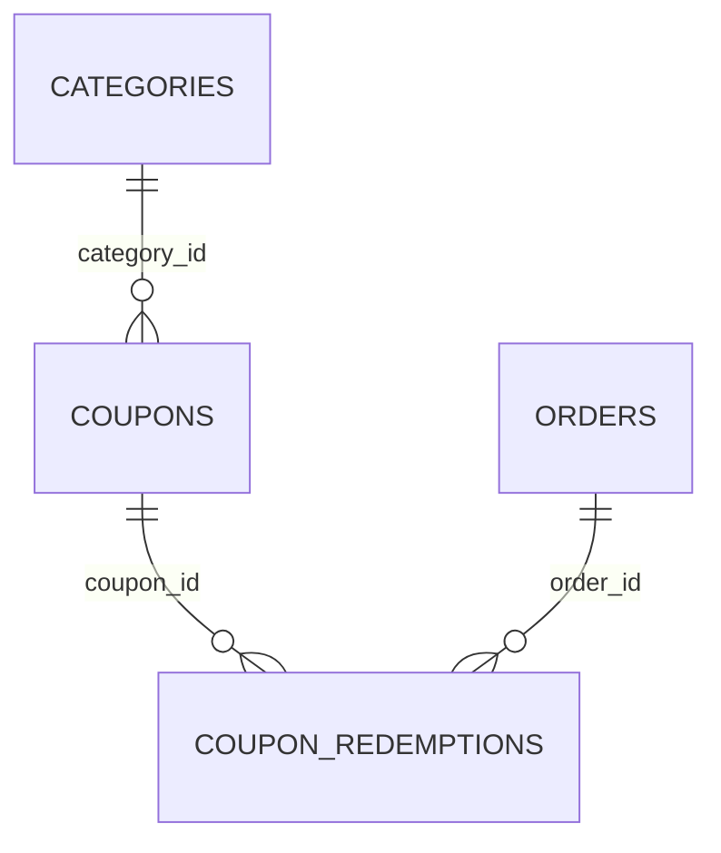

# Vouchers / Coupons Database Schema

Schema for the **Vouchers / Coupons** section of the admin panel (All Coupons,
Create Coupon pages) plus the Settings → Discounts & Coupons page. Types are
written in PostgreSQL dialect; adapt as needed for another engine.

This is a schema proposal only — nothing in the app currently reads from or
writes to a real database. It's derived directly from the fields already
collected/displayed across those pages, so every column below traces back to
a specific form field or table column in the UI.

## Entity-relationship diagram

`CATEGORIES` is defined in
[`category-product-catalog-database-schema.md`](../category-product/category-product-catalog-database-schema.md).
`ORDERS` (and the customer placing it) belong to the not-yet-documented
Orders module — see Design notes.

## Tables

### `coupons`

Backs the All Coupons listing and the Create Coupon form.

| Column                 | Type            | Constraints                                                        | Notes                                                            |
| ----------------------- | --------------- | --------------------------------------------------------------------- | ------------------------------------------------------------------- |
| `id`                    | `UUID`          | PK, default `gen_random_uuid()`                                         |                                                                       |
| `code`                  | `VARCHAR(20)`   | NOT NULL, UNIQUE                                                        | Uppercase `A-Z0-9` only (`formatCode`); "Generate" fills a random one |
| `description`           | `TEXT`          | NULL                                                                    | Internal note, not shown to customers                                |
| `discount_type`         | `VARCHAR(14)`   | NOT NULL, CHECK IN (`percentage`, `fixed`, `free_shipping`)             | "Discount Type" button group                                         |
| `discount_value`        | `DECIMAL(12,2)` | NULL                                                                    | Percentage points or a ₹ amount; NULL when `discount_type = 'free_shipping'` |
| `min_purchase_amount`   | `DECIMAL(12,2)` | NULL                                                                    | "Minimum purchase amount"; NULL = no minimum                        |
| `usage_limit`           | `INTEGER`       | NULL                                                                    | "Limit number of times this coupon can be used in total"; NULL = unlimited |
| `usage_count`           | `INTEGER`       | NOT NULL, DEFAULT `0`                                                   | Running redemption counter; see Design notes                        |
| `one_per_customer`      | `BOOLEAN`       | NOT NULL, DEFAULT `true`                                                | "Limit to one use per customer" toggle                              |
| `status`                | `VARCHAR(10)`   | NOT NULL, DEFAULT `'DRAFT'`, CHECK IN (`ACTIVE`, `SCHEDULED`, `DRAFT`, `EXPIRED`) | Set directly by the admin (ACTIVE/SCHEDULED/DRAFT); EXPIRED is also applied lazily when an ACTIVE or SCHEDULED coupon's `end_date` has passed |
| `start_date`            | `DATE`          | NULL                                                                    | NULL alongside `end_date` shows as "Not scheduled" on the listing    |
| `end_date`              | `DATE`          | NULL                                                                    | NULL = runs indefinitely ("Set an end date" left unchecked)          |
| `applies_to`            | `VARCHAR(8)`    | NOT NULL, DEFAULT `'ALL'`, CHECK IN (`ALL`, `CATEGORY`)                 | "Applies to" select on the Eligibility sidebar                       |
| `category_id`           | `UUID`          | NULL, FK → `categories.id` ON DELETE SET NULL                           | Set only when `applies_to = 'CATEGORY'`                              |
| `created_at`            | `TIMESTAMPTZ`   | NOT NULL, DEFAULT `now()`                                               |                                                                       |
| `updated_at`            | `TIMESTAMPTZ`   | NOT NULL, DEFAULT `now()`                                               |                                                                       |

Indexes: `UNIQUE (code)`, `INDEX (status)`, `INDEX (category_id)`.

### `coupon_redemptions`

One row per successful use of a coupon on an order. Needed to enforce
`usage_limit` / `one_per_customer` at checkout and to audit exactly how much
discount each order received — neither the listing nor the form displays
this table directly, but both `usage_count` and `one_per_customer` are only
enforceable if individual redemptions are recorded somewhere.

| Column            | Type            | Constraints                                              | Notes                                                       |
| ------------------ | --------------- | ------------------------------------------------------------ | -------------------------------------------------------------- |
| `id`               | `UUID`          | PK, default `gen_random_uuid()`                                |                                                                  |
| `coupon_id`        | `UUID`          | NOT NULL, FK → `coupons.id` ON DELETE CASCADE                  |                                                                  |
| `order_id`         | `UUID`          | NOT NULL, FK → `orders.id` ON DELETE CASCADE                   | Orders module — see Design notes                                |
| `customer_id`      | `UUID`          | NULL, FK → `customers.id` ON DELETE SET NULL                   | Customer/account module — see Design notes                     |
| `discount_amount`  | `DECIMAL(12,2)` | NOT NULL                                                       | ₹ actually deducted from that order at redemption time          |
| `redeemed_at`      | `TIMESTAMPTZ`   | NOT NULL, DEFAULT `now()`                                      |                                                                  |

Indexes: `INDEX (coupon_id)`, `INDEX (coupon_id, customer_id)` (used to check
`one_per_customer` before accepting a new redemption).

### `coupon_settings`

Singleton table (always exactly one row) backing the Settings → Discounts &
Coupons page.

| Column                          | Type            | Constraints                       | Notes                                                  |
| --------------------------------- | --------------- | ------------------------------------ | ---------------------------------------------------------- |
| `id`                              | `SMALLINT`      | PK, CHECK (`id = 1`)                  | Enforces a single row                                       |
| `coupons_enabled`                 | `BOOLEAN`       | NOT NULL, DEFAULT `true`              | "Enable the use of coupon codes" — the site-wide kill switch |
| `allow_multiple_coupons`          | `BOOLEAN`       | NOT NULL, DEFAULT `false`             | "Allow multiple coupons per order"                          |
| `max_discount_percent`            | `DECIMAL(5,2)`  | NOT NULL, DEFAULT `50`                | "Maximum Discount Per Order (%)"                            |
| `case_sensitive_coupons`          | `BOOLEAN`       | NOT NULL, DEFAULT `false`             | "Coupon codes are case-sensitive"                           |
| `auto_apply_best_discount`        | `BOOLEAN`       | NOT NULL, DEFAULT `true`              | "Auto-apply best available discount"                        |
| `min_order_amount_for_coupon`     | `DECIMAL(12,2)` | NOT NULL, DEFAULT `0`                 | "Minimum Order Amount for Coupon Use"                        |
| `updated_at`                      | `TIMESTAMPTZ`   | NOT NULL, DEFAULT `now()`              |                                                              |

## Enumerations

| Enum          | Values                                     | Used by                |
| -------------- | -------------------------------------------- | -------------------------- |
| Discount type   | `percentage`, `fixed`, `free_shipping`       | `coupons.discount_type`     |
| Coupon status   | `ACTIVE`, `SCHEDULED`, `DRAFT`, `EXPIRED`    | `coupons.status`            |
| Applies to      | `ALL`, `CATEGORY`                            | `coupons.applies_to`        |

## Design notes

- `discount_value` is only meaningful for `percentage`/`fixed` — a
  `free_shipping` coupon leaves it `NULL`, matching the Create Coupon form's
  Discount Value section, which hides the value input entirely for that type.
- `usage_count` is a denormalized counter rather than a live
  `COUNT(coupon_redemptions)`, because checkout needs a fast, single-row
  check against `usage_limit` without an aggregate query on every attempt.
  It should be incremented in the same transaction that inserts a
  `coupon_redemptions` row, and can be reconciled against
  `SELECT COUNT(*) FROM coupon_redemptions WHERE coupon_id = …` if it ever
  drifts.
- `one_per_customer` cannot be enforced with a single blanket `UNIQUE`
  constraint on `coupon_redemptions`, since the flag is per-coupon (some
  coupons explicitly allow repeat use). Enforcement is an application-level
  check — look up existing rows in `coupon_redemptions` for
  `(coupon_id, customer_id)` before accepting a new redemption — backed by
  the `INDEX (coupon_id, customer_id)` above.
- `orders` and `customers` are referenced by `coupon_redemptions` but not
  defined in this doc; they belong to modules not yet formalized in `docs/`.
  A real migration would add those FKs once those tables exist.
- `category_id` mirrors the single-category "Product category" reference on
  `products` in the catalog schema — a coupon applies to at most one
  category, not an arbitrary set. Multi-category eligibility would need a
  `coupon_categories` join table instead, the same shape as
  `product_collections`.
- `coupon_settings` is modeled as a singleton (`CHECK (id = 1)`) rather than
  a key-value table because the Discounts & Coupons page always edits the
  same fixed set of fields for the whole store, not a per-entity setting.
- `coupons_enabled` on `coupon_settings` is the master switch: when `false`,
  every coupon's redemption path should short-circuit at checkout regardless
  of an individual coupon's own `status`, matching how the settings page
  visually disables the rest of the form the moment the toggle is off.
- Money columns use `DECIMAL(12,2)` rather than float types to avoid rounding
  errors, consistent with the catalog schema's `products.price`.
