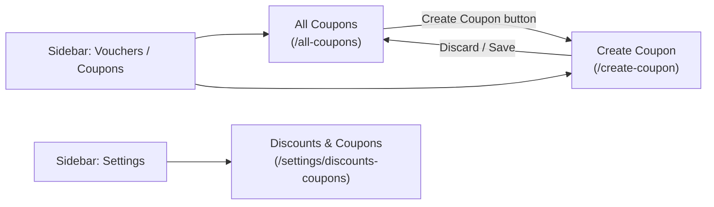
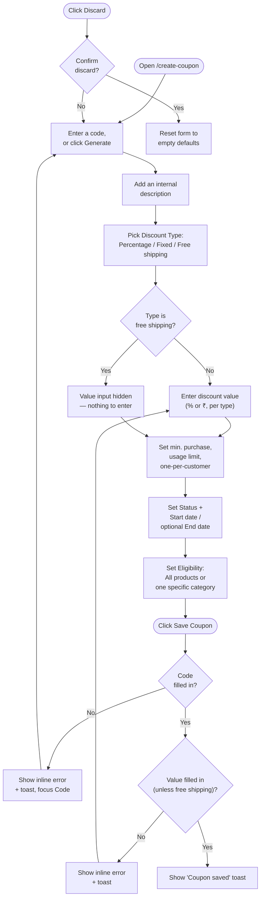
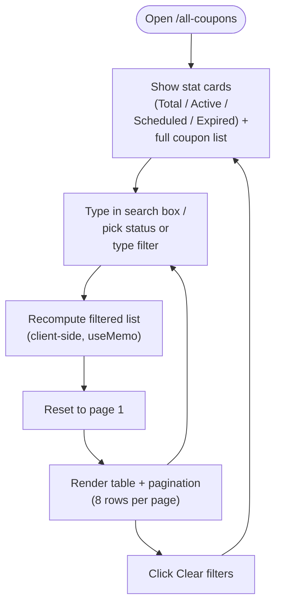
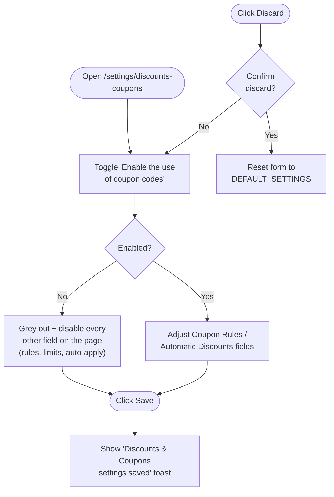
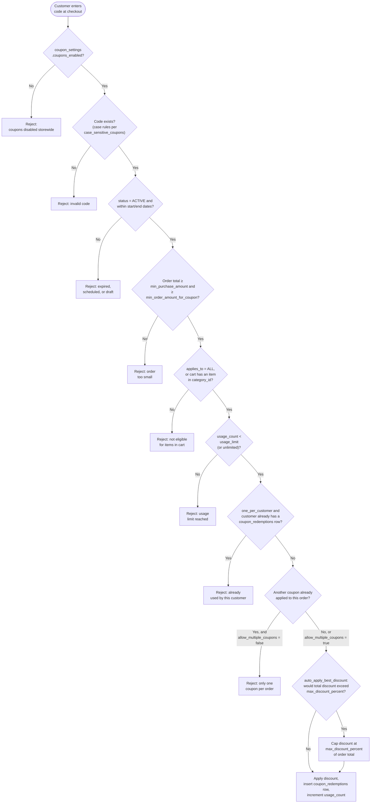
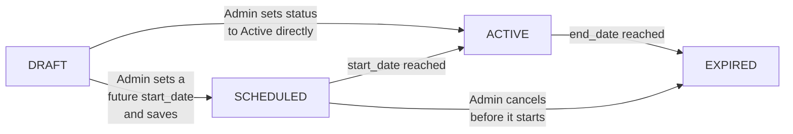

# Vouchers / Coupons Workflow

Process flows for the **Vouchers / Coupons** section of the admin panel
(sidebar submenu: All Coupons, Create Coupon) plus the Settings → Discounts
& Coupons page. Pairs with
[`vouchers-coupons-database-schema.md`](vouchers-coupons-database-schema.md),
which defines the tables these flows would read from and write to once a
real backend exists — today every page here runs on static/in-memory data
only, so "Save" never persists across a page reload.

## 1. Navigation

How the pages connect, starting from the sidebar.

The sidebar auto-expands the "Vouchers / Coupons" submenu and highlights the
current entry based on the active route (see
`src/components/admin-panel/Sidebar.js`) — it isn't hardcoded per page.

## 2. Create Coupon

Key behavior worth calling out:

- **Switching Discount Type clears the value field.** Moving between
  Percentage / Fixed / Free shipping resets `value` to empty rather than
  reinterpreting a stale number under the new type (e.g. a `15` meant as
  15% shouldn't silently become ₹15).
- **The value field itself changes shape by type** — a `%` suffix for
  Percentage, a `₹` prefix for Fixed — and disappears entirely for Free
  shipping, since that type has nothing to discount by amount.
- **There is no backend call.** "Save Coupon" only shows a confirmation
  toast; wiring this to a real API means `INSERT`-ing into `coupons` with
  the shape defined in the database schema doc.

## 3. Browse & filter — All Coupons

- **`CouponsListing.js`** filters by code/description text, status
  (Active/Scheduled/Draft/Expired), and discount type, then paginates 8 rows
  at a time — the same pattern `ProductsListing.js` uses for All Products.
- The four stat cards are computed once from the full dataset
  (`computeCouponStats`), independent of the current filters, so they always
  reflect the whole catalog of coupons rather than the visible page.

## 4. Discounts & Coupons settings

- The master toggle is deliberately the only field that is never itself
  disabled — every other field's `disabled` state is derived from it
  (`disabled={!settings.couponsEnabled}` in `DiscountsCouponsSettingsForm.js`),
  so turning coupons off visibly removes the ability to tune rules that no
  longer apply, without hiding them outright.
- This page has no validation step: any combination of values can be saved,
  unlike Create Coupon's required Code/Value.

## 5. Coupon redemption at checkout (not yet implemented in this app)

The admin pages above only manage coupon *definitions*. The other half of
the feature — a customer actually redeeming a code — has no storefront UI in
this codebase yet, but the schema doc's `coupon_redemptions` table and the
settings above only make sense in light of this flow, so it's documented
here for whoever builds checkout next.

## Coupon status lifecycle

`status` is a value the admin sets directly on the Create Coupon form (via
the Status select), not a column recomputed from dates on every read. A
production system would still want a scheduled job (or a check at query
time) that flips `ACTIVE` rows to `EXPIRED` once `end_date` passes, and
`SCHEDULED` rows to `ACTIVE` once `start_date` arrives, so the stored status
doesn't silently go stale.

## Data lifecycle today vs. with a backend

| Step | Today (this app) | With the schema in `vouchers-coupons-database-schema.md` |
| ---- | ------------------ | ----------------------------------------------------------------------- |
| Load All Coupons | Read a static array from `src/data/couponsData.js` | `SELECT` from `coupons`, optionally joined to `categories` for the eligibility column |
| Filter/search | In-memory `Array.filter` in the browser | `WHERE` clauses (or a search index) pushed to the server, paginated with `LIMIT`/`OFFSET` |
| Save a coupon | Show a confirmation toast only | `INSERT`/`UPDATE` `coupons` in a transaction |
| Save Discounts & Coupons settings | Show a confirmation toast only | `UPDATE` the single `coupon_settings` row |
| Redeem a coupon at checkout | Not implemented | `INSERT` into `coupon_redemptions`, increment `coupons.usage_count`, all inside one transaction so a race between two checkouts can't both succeed past `usage_limit` |
| Discard | Reset local React state | No-op — nothing was written yet |
